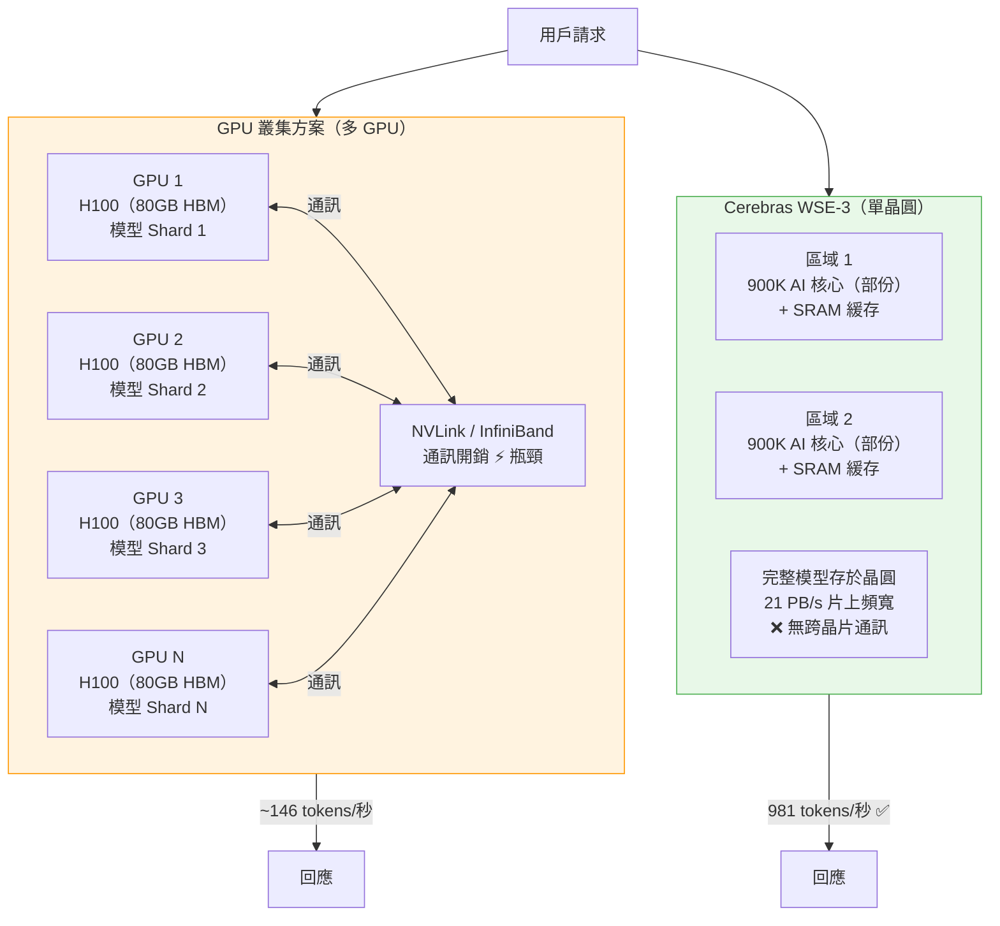

# 晶圓級 AI 推論加速器：Cerebras WSE-3 的架構突破

> [!abstract] 一句話理解
> 這是一個用來「以比 NVIDIA GPU 快 7,000 倍的記憶體頻寬執行大型 AI 模型推論」的晶圓尺寸處理器，特別之處在於它把整片晶圓做成一個超大型晶片，消除了 GPU 叢集間的通訊瓶頸，讓兆參數模型能以接近即時的速度回應。

## 🎯 為什麼重要

**它解決了什麼問題？**

要理解 Cerebras WSE-3 的意義，必須先理解大型語言模型（LLM）推論的根本瓶頸不是**計算能力（FLOPS）**，而是**記憶體頻寬（Memory Bandwidth）**。

**LLM 推論的記憶體瓶頸**

每次 LLM 生成一個 token（大約一個英文單字），都需要從記憶體中讀取模型的所有參數一次。對於一個 1 兆參數（1 trillion parameter）的模型（如 Kimi K2.6），即使使用 16-bit 精度，參數本身就需要約 2TB 的儲存空間。

問題是：GPU（如 NVIDIA H100）的 HBM（High Bandwidth Memory）雖然已經是高速記憶體，但其頻寬約為 3.35 TB/s。這意味著每秒讀取完整兆參數模型需要約 0.6 秒——理論上每秒最多只能生成 1-2 個 token。

**GPU 叢集的另一個問題：通訊開銷**

為了容納兆參數模型，必須把它分散到多個 GPU 上（tensor parallelism、pipeline parallelism）。但 GPU 之間通過 NVLink 或 InfiniBand 通訊，這種通訊延遲和頻寬限制成為新的瓶頸——整個叢集的推論速度受限於最慢的通訊環節。

**WSE-3 的解法**：用一個有 7,000 倍更高記憶體頻寬的超大晶片，同時消除叢集間通訊延遲，在根源上解決這兩個問題。

## 🧠 入門解說（用類比理解）

**類比：圖書館 vs 個人書房**

想像你是一位研究員，需要不斷翻閱大量書籍（AI 模型的參數）來回答問題（生成 token）。

**GPU 叢集方案**（傳統做法）：
你把書分散存放在城市各區 30 個圖書館分館。每次需要查閱，你必須打電話給各分館讓他們快遞書籍，而快遞需要時間（通訊延遲）。速度受限於最慢的快遞服務。

**Cerebras WSE-3 方案**：
你有一個超大型個人書房，所有書都放在觸手可及的地方，而且書架設計成你可以在 0.001 秒內找到任何一本書（超高記憶體頻寬）。不需要打電話，不需要等快遞，直接取用。

結果就是：Cerebras 研究員每秒能回答 981 個問題，而 GPU 叢集研究員每秒只能回答約 146 個。

## 🔑 重點原理

1. **晶圓尺寸引擎（Wafer Scale Engine）的核心思想**：傳統半導體製造是把晶圓切割成幾百個小晶片（die），再封裝成 GPU 或 CPU。Cerebras 的想法是：**直接把整片晶圓做成一個完整的晶片**。WSE-3 晶圓面積約 46,225 mm²（普通 GPU 約 800 mm²），包含 4 兆個電晶體和 900,000 個 AI 核心。缺點是良率挑戰巨大（任何缺陷都可能影響整片晶圓），Cerebras 用冗餘設計（redundancy）解決了這個問題。

2. **記憶體頻寬優勢：SRAM vs HBM**：WSE-3 使用 **SRAM（靜態隨機存取記憶體）** 作為主要儲存，而不是 GPU 使用的 HBM（高頻寬記憶體）。SRAM 比 HBM 快得多，但面積大、成本高。在整片晶圓的尺度下，Cerebras 能夠集成足夠的 SRAM 達到比 H100 高 **7,000 倍** 的記憶體頻寬（WSE-3 約 21 PB/s vs H100 的 3.35 TB/s）。

3. **片上通訊 vs 晶片間通訊**：在 GPU 叢集中，模型的不同部分存放在不同 GPU 上，它們之間的通訊通過 NVLink 或 InfiniBand（約 800 Gbps - 3.2 Tbps）進行。在 WSE-3 中，所有計算都在同一塊晶圓上，晶片內部通訊頻寬高達數 PB/s——比叢集間通訊快幾個數量級。這消除了一個完整類別的延遲問題。

4. **稀疏計算優化（Sparse Computation）**：並非 LLM 的所有層都需要所有核心的參與。WSE-3 支持動態稀疏性（dynamic sparsity），可以跳過對特定輸入不活躍的參數，進一步提升有效吞吐量。

5. **良率工程的核心挑戰**：整片晶圓的缺陷控制是 Cerebras 最核心的技術護城河。半導體製造過程不可避免有瑕疵，傳統做法是切割成小晶片後測試，丟棄壞片。對整片晶圓，Cerebras 在設計上加入了冗餘核心（redundant cores），壞核心自動被停用，由冗餘核心接替，確保整體性能。這需要極其精密的良率管理和電路設計能力。

## 📊 視覺化說明

### WSE-3 vs GPU 叢集推論架構對比

### 記憶體頻寬與推論速度對比

| 指標 | NVIDIA H100 | Cerebras WSE-3 |
|---|---|---|
| **記憶體類型** | HBM3（8 疊）| SRAM（片上）|
| **記憶體頻寬** | 3.35 TB/s | ~21 PB/s（6,000× 更高）|
| **單卡記憶體容量** | 80 GB | 40 GB（純 SRAM）|
| **Kimi K2.6 推論速度** | ~146 tokens/秒（叢集）| **981 tokens/秒** |
| **相對速度** | 1× | **6.7×** |
| **功耗** | 700W | 約 20 kW（整片晶圓）|
| **定價模式** | 按 GPU 租用 | 按 token 計費 |

## 🔍 與既有技術的差異

**vs. NVIDIA H100/H200（GPU 主流）**

NVIDIA 的策略是把更多 HBM 堆疊在 GPU 旁邊，H100 有 80GB HBM3，H200 有 141GB HBM3e。這提升了記憶體容量，但無法根本解決 **SRAM vs HBM 的頻寬差距**。Cerebras 的 SRAM 在密度上劣於 HBM，但頻寬高出數個數量級。

**vs. 傳統晶片設計方法（Chiplet）**

英特爾（Intel）和 AMD 採用 Chiplet（小晶片拼接）策略，把多個小晶片封裝在一起。Chiplet 有更好的良率（因為各晶片獨立測試），但晶片間通訊仍有延遲。Cerebras 是走向相反方向——**擴大單一晶片而非拼接多個晶片**。

**vs. Groq、SambaNova（其他推論加速器）**

Groq（LPU 架構）和 SambaNova 也專注推論速度，但規模更小（通常針對較小的模型）。Cerebras WSE-3 是目前在**兆參數**規模上最快的非 GPU 選項。

## 📚 關鍵詞對照表

| 中文 | 英文 | 簡短解釋 |
|---|---|---|
| 晶圓尺寸引擎 | Wafer Scale Engine (WSE) | 把整片晶圓做成一個巨大晶片的 AI 加速器設計方式 |
| 記憶體頻寬 | Memory Bandwidth | 每秒能從記憶體讀取或寫入多少數據，是 LLM 推論速度的主要限制 |
| 高頻寬記憶體 | HBM (High Bandwidth Memory) | NVIDIA GPU 使用的堆疊式 DRAM，比傳統 DRAM 快但比 SRAM 慢 |
| 靜態隨機存取記憶體 | SRAM | 速度最快的記憶體類型，Cerebras WSE-3 主要使用，但每比特成本高於 HBM |
| 張量並行 | Tensor Parallelism | 把單一模型層的矩陣分散到多個 GPU 上並行計算的技術 |
| 管線並行 | Pipeline Parallelism | 把模型的不同層分配到不同 GPU，讓各 GPU 並行處理不同 batch 的技術 |
| 稀疏計算 | Sparse Computation | 只對非零值進行計算，跳過零值，以節省計算資源 |
| 良率 | Yield (Semiconductor) | 製造過程中合格晶片占所有生產晶片的比例 |

## 🛠️ 可能的應用場景

1. **低延遲 AI 客服**：當每個用戶查詢的響應時間從 30 秒縮短到 2 秒，對話 AI 的用戶體驗根本性改善，使服務機器人在實際業務場景中真正可用。
2. **即時程式碼生成**：IDE 中的 AI 編程助手（如 Devin、Copilot）需要實時建議，981 tokens/秒的速度意味著複雜函式的生成可在毫秒級完成。
3. **高頻金融分析**：JPMorgan、Goldman Sachs 等需要在市場波動時快速分析大量文件，推論速度直接影響決策窗口。
4. **AI Agent 行動循環加速**：Agent 的「感知-推理-行動-觀察」循環（agentic loop）每一輪都需要模型推論，更快的推論直接提升整個 Agent 的執行效率。
5. **高並發 AI 服務**：對需要同時服務百萬用戶的 AI 服務商（如 ChatGPT、Claude.ai），更高的吞吐量意味著相同成本下可服務更多用戶。

## 📖 學習路徑建議

1. **先讀**：了解 Transformer 推論的基本流程（自回歸解碼、KV 緩存），理解為什麼 token 生成速度受限於記憶體頻寬而非計算力
2. **再讀**：本篇文章——Cerebras WSE-3 如何從硬體層面解決這個限制
3. **進階**：閱讀 Cerebras 的技術白皮書，了解 WSE 的良率工程和稀疏計算的具體實作
4. **進階**：比較研究 Groq LPU 架構，理解「確定性推論（deterministic inference）」的不同設計思路
5. **進階**：了解模型量化（INT4、FP8）如何與 WSE-3 的 SRAM 架構互動，找到成本最優化點

## 🔗 延伸閱讀
- 原文連結：[VentureBeat - Cerebras 推論新紀錄](https://venturebeat.com/technology/cerebras-says-its-chips-run-a-trillion-parameter-ai-model-nearly-7-times-faster-than-gpu-clouds)
- 對應新聞筆記：[[2026-05-31-Cerebras以WSE-3晶片達兆參數推論新紀錄每秒981tokens]]
- Cerebras 官方部落格：[2026 Insights - Fast Inference Finds Its Groove](https://www.cerebras.ai/blog/2026Insights)
- Artificial Analysis 評測平台：[AI 推論速度獨立測量](https://artificialanalysis.ai)

---
*由 Claude 自動整理於 2026-05-31*
