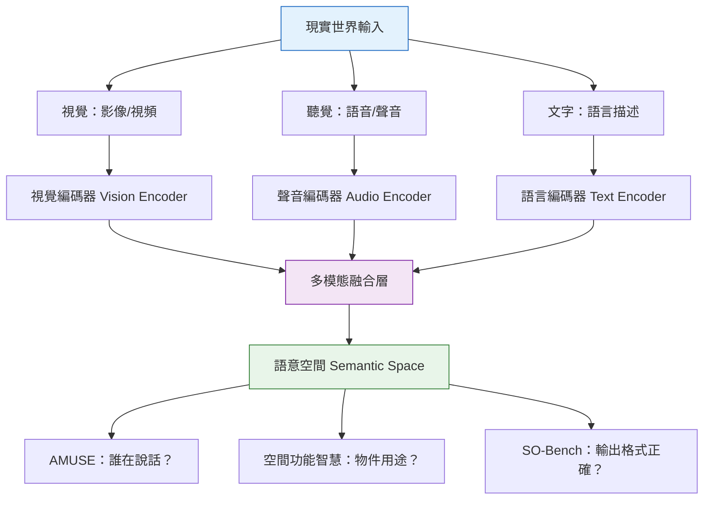

# Apple 多模態 AI 與空間智慧：CVPR 2026 研究解析

> [!abstract] 一句話理解
> 這是一系列用來「讓 AI 真正理解現實世界中的視覺、聲音和空間關係」的研究，特別之處在於它不只問「物件在哪裡」，還進一步問「物件是用來做什麼的」，讓 AI 具備接近人類直覺的環境理解能力。

## 🎯 為什麼重要

**它解決了什麼問題？**

當前的 AI 模型（包括 GPT-4o、Gemini、Claude）在處理文字時已相當強大，但在「理解現實世界的多感官輸入」上仍有明顯不足：

**問題一：多說話者場景的困惑**
在家庭對話、多人會議、課堂場景中，AI 助理（如 Siri）難以分辨「誰在說什麼」——即使聽得到聲音，也無法結合視覺線索（看誰在動嘴）來確認說話者身份，導致轉錄和理解錯誤。

**問題二：空間理解停留在「在哪裡」層次**
現有的空間 AI 能做到「桌子在沙發右邊 1.5 公尺」，但無法理解「桌子是用來放電腦工作的，沙發是用來休息的」——這種「物件功能」的理解對 AR/VR 環境和 AI Agent 至關重要。

**問題三：多模態 LLM 的輸出格式不可靠**
要讓多模態 AI 真正有用，它必須能把看到的圖表、表格、介面轉換成結構化的 JSON 或程式碼——但現有模型在這種「結構化輸出」任務上的表現差異極大，而且缺乏標準化的評估方法。

Apple 在 CVPR 2026 發表的研究，正是針對這三個核心問題提出解決方案。

## 🧠 入門解說（用類比理解）

**用「偵探讀場景」來理解多模態 AI 的挑戰**

想像一位偵探進入案發現場，他需要同時：
1. **聽**：誰說了什麼、語氣如何
2. **看**：誰在哪裡、物件的擺放
3. **推理**：這些東西「是用來做什麼的」——那把椅子是辦公用的還是裝飾的？那個破口是入侵者留的還是屋主的？

**現在的 AI 助理就像一個「只有超強記憶力但缺乏直覺」的偵探**：
- 能背出所有法條（海量知識）
- 能描述場景中的每個物件（視覺識別）
- 但無法直覺理解「這把椅子面對著電視，所以這裡是用來看電視的」

**AMUSE（多說話者音視覺理解）**：教會偵探同時用眼睛和耳朵確認「誰在說話」

**空間功能智慧（Spatial-Functional Intelligence）**：教會偵探從物件的擺放推斷空間的「用途」

**SO-Bench（結構化輸出評估）**：建立一套標準考題，測試偵探能否把觀察整理成可用的報告格式

## 🔑 重點原理

1. **多模態融合（Multimodal Fusion）**：人類理解世界是同時整合視覺、聽覺、觸覺等多種感官輸入的。多模態 AI 模型的核心挑戰是如何讓神經網路有效「融合」不同形式的輸入——圖像的像素矩陣、聲音的頻譜、文字的 token，這三種完全不同的數學表示需要被映射到共同的語意空間中才能互相理解。

2. **說話者辨識（Speaker Diarization）**：AMUSE 的核心技術是「誰說了什麼（who said what）」的問題。傳統方法只依賴聲音特征（音色、音頻特徵），AMUSE 整合了嘴唇動作視頻（lip movement video）——即使多人同時在場，只要攝影機看得到嘴，就可以辨識說話者。這對 Apple Vision Pro 和 iPhone FaceTime 場景有直接應用價值。

3. **空間功能推理（Spatial-Functional Reasoning）**：從「3D 定位」到「功能理解」需要引入常識知識（commonsense knowledge）。「桌子的上方有顯示器、鍵盤」這組空間關係，加上「顯示器和鍵盤是工作工具」的常識，就能推斷「這是一個工作站區域」。Apple 的研究試圖讓模型從視覺空間輸入中自動完成這種常識推理。

4. **結構化輸出評估（Structured Output Evaluation）**：SO-Bench 針對的是「模型看到圖表後，能否生成符合格式的 JSON / 表格 / 程式碼」。這不是問模型理不理解（semantics），而是問它能否「格式遵循（format following）」——這是多模態 AI 從「能力展示」走向「生產可用」的關鍵一步。

5. **中央-周邊視覺啟發架構（CVP）**：人眼的注意力不是均勻分布的——中央凹（fovea）提供高解析度清晰視野，周邊視覺提供低解析度但大範圍的情境感知。CVP 模型模仿這種機制：對圖像中心區域投入更多計算資源（高解析度 token），周邊用低解析度 token 捕獲整體佈局，在空間推理任務上比傳統均勻 patch 切割更高效。

## 📊 視覺化說明

### 多模態 AI 的感知層次

### Apple CVPR 2026 研究主題比較

| 研究 | 核心問題 | 輸入 | 輸出 | 應用場景 |
|---|---|---|---|---|
| **AMUSE** | 誰在說什麼？ | 影片 + 音頻 | 說話者-文字對照 | Siri、FaceTime、會議記錄 |
| **CVP** | 如何高效分配注意力？ | 圖像 | 空間推理答案 | Vision Pro、AR 場景 |
| **空間功能智慧** | 物件用途是什麼？ | 3D 場景 | 功能標籤 | 智慧家居、機器人 |
| **SO-Bench** | 輸出格式對不對？ | 圖表/介面 | JSON / 表格 / 程式碼 | Apple Intelligence 可靠性 |

## 🔍 與既有技術的差異

**vs. GPT-4V / Gemini Vision（通用視覺-語言模型）**

現有大型多模態模型的強項是「描述圖片」（image captioning）和「回答圖片相關問題」（visual QA），但在多說話者辨識和空間功能理解上沒有專項設計。Apple 的研究是針對特定、難度更高的任務建立專項模型和評估基準。

**vs. Microsoft Azure Spatial AI**

Microsoft 的空間 AI 主要聚焦在 HoloLens 的工業應用（設備維修指引、空間地圖），而 Apple 的空間功能智慧更偏向「消費場景的直覺理解」（住家環境、辦公室），與 Vision Pro 的定位高度對應。

**vs. Meta EgoBlur / Aria Research**

Meta 在第一人稱視角（egocentric）的空間理解研究上有豐富積累（Aria 眼鏡計畫），但重心在戶外和社交場景。Apple 的研究更聚焦在室內環境和裝置內建的隱私保護能力（不需要雲端傳輸）。

## 📚 關鍵詞對照表

| 中文 | 英文 | 簡短解釋 |
|---|---|---|
| 多模態融合 | Multimodal Fusion | 將不同類型的輸入（文字、圖像、聲音）整合為統一表示的技術 |
| 說話者辨識 | Speaker Diarization | 在多人場景中辨識「誰在什麼時候說了什麼」的技術 |
| 空間推理 | Spatial Reasoning | 理解物件之間位置關係、距離和方向的 AI 能力 |
| 空間功能智慧 | Spatial-Functional Intelligence | 不只理解物件在哪裡，還理解物件「用途為何」的高階空間認知 |
| 結構化輸出 | Structured Output | AI 模型按照特定格式（JSON、XML、表格）生成內容的能力 |
| 中央凹 | Fovea / Foveal Vision | 人眼視網膜中心的高解析度區域，是注意力焦點所在 |
| 電腦視覺 | Computer Vision | 讓計算機從影像和視頻中提取信息和理解內容的 AI 領域 |

## 🛠️ 可能的應用場景

1. **智慧會議室系統**：整合 AMUSE 技術的視訊會議系統，自動生成「誰說了什麼」的精確會議記錄，區分多個說話者
2. **Apple Vision Pro 場景理解**：空間功能智慧讓 Vision Pro 的 AI 助理能理解用戶所在空間的功能區分（工作區、休息區），自動調整 AR 疊加內容
3. **無障礙功能強化**：結合音視覺說話者辨識，幫助聽障用戶在嘈雜環境中識別不同說話者
4. **Apple Intelligence 可靠性提升**：SO-Bench 型的評估機制確保 Apple Intelligence 在將文件截圖轉換為可編輯格式時的格式準確性
5. **室內機器人導航**：空間功能智慧幫助家用機器人理解廚房、客廳、臥室的不同功能需求，做出更合適的行為

## 📖 學習路徑建議

1. **先讀**：視覺-語言模型（VLM）的基礎概念——CLIP 模型的對比學習原理，理解文字和圖像如何映射到共同的語意空間
2. **再讀**：本篇對應的新聞筆記，了解 Apple CVPR 2026 研究的整體佈局
3. **進階**：AMUSE 研究方向的前置論文——AV-Diarization（音視覺說話者辨識）領域的基礎工作
4. **進階**：閱讀 Apple Machine Learning Research 官方頁面上發表的論文原文（CVPR 後公開）
5. **延伸**：Meta Ego4D 資料集論文，了解第一人稱視角多模態理解的資料建立方法

## 🔗 延伸閱讀
- 原文連結：[Apple Machine Learning Research - CVPR 2026](https://machinelearning.apple.com/updates/apple-at-cvpr-2026)
- 對應新聞筆記：[[2026-06-01-Apple於CVPR 2026發表14篇AI研究聚焦多模態空間智慧]]
- 相關論文：[CVP - 中央周邊視覺空間推理（arXiv）](https://arxiv.org/pdf/2512.08135)
- 相關論文：[MM-Spatial - 3D 空間理解（arXiv）](https://arxiv.org/pdf/2503.13111)

---
*由 Claude 自動整理於 2026-06-01*
