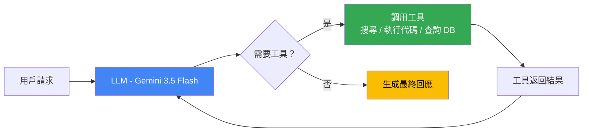

# Gemini 3.5 Flash：代理 AI 架構設計與效率優化入門

> [!abstract] 一句話理解
> 這是一個用來「讓 AI 模型以更低成本、更快速度完成多步驟代理工作流任務」的架構優化方向，特別之處在於它讓「閃速版（Flash）」模型在代理 AI 基準測試上超越了「旗艦版（Pro）」模型，打破了「大模型才能做困難任務」的固有認知。

## 🎯 為什麼重要

**它解決了什麼問題？**

**問題一：AI Agent 需要頻繁調用大模型，成本驚人**

傳統的思維是：難任務用旗艦大模型（Pro 等級），簡單任務用輕量模型（Flash 等級）。但 AI Agent 在執行複雜任務時，往往需要：
- 每次工具調用（tool call）都調用一次 LLM
- 一個複雜任務可能涉及 50-200 次 LLM 調用
- 如果每次都用旗艦模型，成本可能高達數十美元 / 任務

**問題二：推論速度成為 Agent 體驗的瓶頸**

AI Agent 的用戶體驗取決於延遲（latency）：
- 多步驟任務中，每次 LLM 調用的延遲會累積
- 旗艦模型每次調用可能需要 3-10 秒
- 100 次調用 × 5 秒 = 8 分鐘等待時間——這不可接受

**問題三：現有基準測試偏向靜態知識，不反映 Agent 能力**

傳統基準（MMLU、HellaSwag）測試的是「模型知道多少知識」，但 AI Agent 的核心能力是「能完成多少實際任務」——使用工具、執行代碼、跨步驟保持一致性。缺乏針對這些能力的標準評估方法。

Gemini 3.5 Flash 的出現正是對以上三個問題的正面回應。

## 🧠 入門解說（用類比理解）

**用「快遞分揀中心」來理解 Flash vs Pro 模型的效率革命**

想像一個快遞分揀中心，過去的做法是：
- **Pro 模型**= 一位超有經驗的老師傅，什麼件都能分揀，但速度慢、成本高
- **Flash 模型（舊）**= 剛入職的新員工，速度快但只能處理簡單的件，複雜包裹還是得找老師傅

**Gemini 3.5 Flash 的改變**= 給新員工進行了「任務特化訓練」：
- 不是要新員工學習老師傅的所有知識（那太慢）
- 而是針對「分揀中心最常遇到的 80% 任務」進行深度訓練
- 同時優化「從收包裹到分好類」這個完整工作流的效率

結果：在分揀中心的實際工作表現（Terminal-Bench、SWE-Bench）上，新員工已超越老師傅——不是因為更聰明，而是因為「更專精於這個具體場景」。

**Gemini Spark 的類比**= 把這位快速的分揀員配備了一個「全天候任務調度系統」：
- 即使你不在辦公室，系統也在持續運作
- 自動從你的郵件、行事曆拉取任務
- 分揀員（3.5 Flash）快速處理，你回來看結果就好

## 🔑 重點原理

1. **代理 AI 基準測試（Agentic AI Benchmarks）**：衡量模型在完成多步驟實際任務時的表現，而非靜態知識測試。主要基準包括：**SWE-Bench**（軟體工程任務——自動修 bug、寫功能）、**Terminal-Bench**（命令行工具使用能力）、**MCP Atlas**（模型環境協定工具調用）。這些基準更接近 AI Agent 的實際使用場景。

2. **Token 吞吐量（Token Throughput）優化**：Flash 模型能每秒輸出更多 token，這在 AI Agent 的場景下極為重要。Gemini 3.5 Flash 聲稱「比同等級前沿模型快 4 倍」，意味著相同的 Agent 任務，等待時間縮短 75%。

3. **工具調用優化（Tool Use Optimization）**：AI Agent 的核心能力是調用工具（搜尋、執行代碼、查詢資料庫）。模型需要：(a) 正確識別何時調用工具；(b) 傳入正確的參數；(c) 解析工具返回的結果繼續推理。3.5 Flash 在這三個步驟上都有針對性優化。

4. **長上下文一致性（Long-Context Consistency）**：1M tokens 的上下文視窗在 AI Agent 場景下意味著 Agent 可以「記住」整個任務的歷史——包括所有工具調用的輸入和輸出，不會在任務中途「忘記」早期的決策。這對複雜、多步驟任務至關重要。

5. **Flash vs Pro 架構差異**：「Flash」通常指規模較小但速度更快的模型，通過蒸餾（distillation，讓小模型學習大模型的輸出）和架構優化（如更激進的注意力壓縮、更少的層數）實現。Gemini 3.5 Flash 超越 3.1 Pro，說明蒸餾技術已足夠成熟，小模型在特定任務上的表現可以超越其「老師」。

6. **模型蒸餾（Knowledge Distillation）**：大模型（Teacher）用自己的輸出指導小模型（Student）訓練。與直接訓練小模型相比，蒸餾讓小模型學習到更「軟性」的概率分佈（大模型對各個選項的信心程度），而不只是「正確答案」，通常能顯著提升小模型的推理品質。

## 📊 視覺化說明

### AI Agent 多步驟任務的調用流程

### Flash vs Pro 模型的效率與成本比較

| 維度 | Gemini 3.1 Pro（上代旗艦）| Gemini 3.5 Flash（新款）|
|---|---|---|
| 定位 | 旗艦模型，最高能力 | 效率模型，代理 AI 優化 |
| 輸出速度 | 標準速度 | **4 倍更快** |
| 定價（輸入/輸出）| 較高 | $1.50 / $9.00 per M tokens |
| SWE-Bench（軟體工程）| ≈80% | **81.0%**（超越）|
| Terminal-Bench 2.1 | < 76.2% | **76.2%** |
| MCP Atlas | < 83.6% | **83.6%** |
| 上下文視窗 | 1M tokens | **1M tokens** |
| 適合場景 | 複雜推理、研究分析 | **AI Agent、高頻調用、即時任務** |

## 🔍 與既有技術的差異

**vs. GPT-5.5（OpenAI）**

GPT-5.5 於 2026 年 4 月發布，同樣強調代理 AI 能力，但 OpenAI 的定價策略不同，且 GPT-5.5 更側重「理解意圖」和「主動執行」（less oversight required）。Gemini 3.5 Flash 的優勢在於 Google 生態的深度整合（Gmail、GCP、Google Workspace）。

**vs. Claude Opus 4.6（Anthropic）**

Claude Opus 4.6 在 SWE-Bench 上達 80.8%，被 Gemini 3.5 Flash 的 81.0% 超越，但 Anthropic 的 Claude 系列在長文件推理和安全性方面仍有差異化。Anthropic 通過 Claude Code 在程式碼開發場景深耕。

**vs. 前代 Gemini Flash 系列**

Gemini 2.0 Flash 到 3.5 Flash 的進步在於：(1) 明確以代理 AI 基準作為主要優化目標；(2) 引入 MCP Atlas 等更複雜的工具調用基準；(3) 成為 Gemini App 的預設模型，意味著 Google 已確信其能力足夠成熟。

## 📚 關鍵詞對照表

| 中文 | 英文 | 簡短解釋 |
|---|---|---|
| 代理 AI | AI Agent / Agentic AI | 能自主執行多步驟任務、調用工具的 AI 系統 |
| 知識蒸餾 | Knowledge Distillation | 讓小模型學習大模型輸出的訓練技術 |
| Token 吞吐量 | Token Throughput | 模型每秒能生成的 token 數量，決定輸出速度 |
| 工具調用 | Tool Use / Function Calling | AI 模型調用外部工具（搜尋、API、代碼執行）的能力 |
| SWE-Bench | Software Engineering Benchmark | 評估 AI 在真實 GitHub issue 上自動修復 bug 能力的基準測試 |
| MCP | Model Context Protocol | Anthropic 提出的模型與工具交互標準協定，已被業界廣泛採用 |
| 推論速度 | Inference Speed / Latency | AI 模型從接收輸入到生成輸出的時間 |

## 🛠️ 可能的應用場景

1. **自動化軟體開發**：AI Agent 以 3.5 Flash 為核心，自動拉取 GitHub issue、分析程式碼、生成修復 patch 並提交 PR
2. **客服 Agent 流水線**：高頻客服問題由 3.5 Flash 快速分類和初步解答，複雜問題才轉交人工或旗艦模型
3. **個人數位助理（Gemini Spark）**：24/7 監控郵件、整理行事曆、自動起草回應，以 Flash 的低成本實現全天候運作
4. **企業資料分析 Agent**：Agent 自動從多個資料庫查詢數據、生成 SQL、執行分析並生成報告，整個流程由 3.5 Flash 驅動
5. **電商 Agentic Commerce**：AI 助理在用戶授權下自動比價、下訂單、追蹤物流，每個步驟的工具調用都依賴快速、低成本的 Flash 模型

## 📖 學習路徑建議

1. **先讀**：了解 LLM 的基礎推論原理（自回歸生成、temperature、top-p sampling），理解模型如何逐 token 生成輸出
2. **再讀**：AI Agent 的基礎架構——ReAct（Reason + Act）框架，理解「思考-行動-觀察」循環
3. **再讀**：本篇對應的新聞筆記，了解 Gemini 3.5 Flash 的完整技術背景
4. **進階**：SWE-Bench 原始論文，理解評估 AI 軟體工程能力的方法論
5. **進階**：MCP（Model Context Protocol）規格文件，了解 AI 工具調用的標準化方向

## 🔗 延伸閱讀
- 原文連結：[MarkTechPost - Gemini 3.5 Flash at I/O 2026](https://www.marktechpost.com/2026/05/20/google-introduces-gemini-3-5-flash-at-i-o-2026-a-faster-and-cheaper-model-for-ai-agents-and-coding/)
- 對應新聞筆記：[[2026-06-01-Google Gemini 3.5 Flash於IO 2026發布超越上代Pro模型]]
- Google I/O 2026 全公告：[100 things we announced at Google I/O 2026](https://blog.google/innovation-and-ai/technology/ai/google-io-2026-all-our-announcements/)
- Gemini Spark 介紹：[Gemini Spark – 24/7 Personal AI Agent](https://gemini.google/overview/agent/spark/)

---
*由 Claude 自動整理於 2026-06-01*
