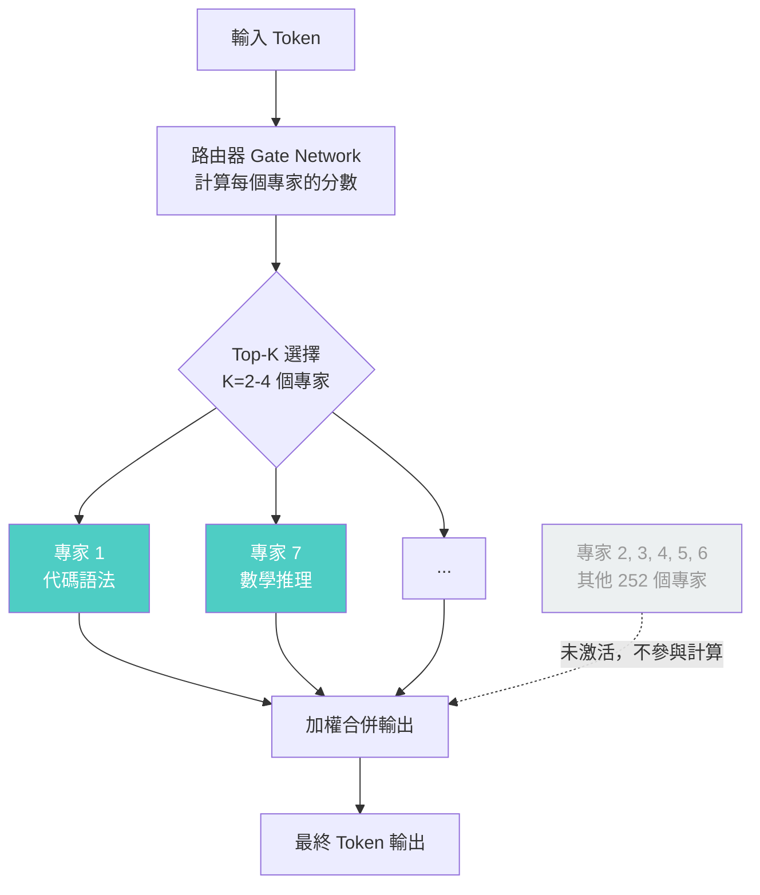

# MoE 混合專家架構與多代理蜂群設計

> [!abstract] 一句話理解
> 這是一個用來「讓超大型 AI 模型在不增加推論成本的情況下大幅提升能力」的架構方法，特別之處在於它讓 1 兆個參數的模型在每次推論時只「激活」其中的 3.2%，同時配合多代理蜂群讓數百個 AI 同時協作完成複雜任務，把不可能的計算規模變得實際可行。

## 🎯 為什麼重要

**它解決了什麼問題？**

**問題一：超大模型的推論成本高得難以部署**

傳統的 Dense LLM（密集型大模型）在推論時，模型的每一個參數都參與計算。如果模型有 1 兆個參數，每生成一個 token 就需要對 1 兆個參數進行矩陣運算——這需要大量的記憶體（VRAM）和計算資源，讓超大模型在實際部署中成本極高、延遲極大。

**問題二：模型能力的「一刀切」限制**

Dense 模型的所有參數對所有任務的貢獻是平等的。但實際上，「翻譯」和「寫程式」對模型能力的需求差異很大。如果模型能依據任務類型「動態選擇」最相關的子網路，理論上可以在同等計算成本下提供更專業的能力。

**問題三：AI Agent 的任務複雜度遠超單次對話**

傳統 LLM 設計是「一問一答」的模式。但複雜的工程任務（如重構一個大型程式庫、執行市場研究報告）需要幾十甚至幾百個步驟，且許多步驟可以並行。單一模型串列執行顯然效率低下，需要一個「多代理協作系統」。

MoE 架構和多代理蜂群設計分別解決了以上前兩個和第三個問題，Kimi K2.6 將兩者結合，是目前開源世界中最極端的示範。

## 🧠 入門解說（用類比理解）

**MoE 架構：用「醫院分科制度」理解**

傳統 Dense 模型就像一個「全科醫師」——無論你是骨折、心臟病還是皮膚問題，都由同一個醫師全部處理。當問題很多元時，全科醫師的每個領域都只能達到平均水準。

MoE 架構（混合專家）就像一個設有**心臟科、骨科、皮膚科、神經科**等多個科別的醫院：
- 每個「科別」= 一組「專家網路（Expert Network）」
- **掛號台（Gate Network）**= 路由器，決定把這個問題分配給哪個科
- 你的問題（輸入 token）進來後，路由器決定激活「最相關的 2-4 個科別」
- 其他科別的醫師繼續待命，但不參與這次診療——**計算資源沒有浪費**

結果：醫院看起來有 1 兆個醫師（參數），但每次服務只動員其中 3.2%（激活 320 億參數）。

**多代理蜂群：用「工程師團隊」理解**

想像你是一個工程部門的主管，有一個超大型任務：「在一個月內重構整個電商系統」。如果只有一個工程師，他需要：後端 → 前端 → 資料庫 → 測試 → 部署，全部串列，每步等上一步完成。

多代理蜂群就像你雇用了 300 個工程師（子代理），同時讓：
- 50 人分析現有程式庫
- 80 人寫後端 API
- 60 人寫前端
- 70 人寫測試
- 40 人監控整合問題
- 主管（主代理）統籌協調，處理衝突，整合結果

Kimi K2.6 的 300 子代理 × 4,000 步驟，就是把這個「300 工程師並行工作 4,000 個任務步驟」的能力做到了 AI 系統中。

## 🔑 重點原理

1. **專家網路（Expert Network）**：MoE 模型的 Feed-Forward 層由多個並行的「專家子網路」組成（Kimi K2.6 約有 256 個專家）。每個專家本質上是一個較小的前饋神經網路，特化於不同類型的語言或知識模式。在訓練過程中，某些專家自然地學會了「數學推理」，另一些則擅長「程式碼語法」。

2. **路由機制（Gating / Routing）**：決定每個 token 應送往哪些專家的「路由器」是 MoE 的核心。Kimi K2.6 採用的是 **Top-K Sparse Routing**：對每個輸入 token，路由器選擇分數最高的 K 個專家（通常 K=2-4），其餘專家輸出為零（稀疏激活）。這使得即使有 256 個專家，計算量也只相當於激活 2-4 個的成本。

3. **專家平衡損失（Load Balancing Loss）**：一個常見問題是「明星效應」——大部分 token 都路由到同一批熱門專家，冷門專家永遠不被訓練。MoE 訓練中通常加入「平衡損失（auxiliary loss）」以確保所有專家獲得近似均勻的訓練機會，避免能力退化。

4. **多代理協作的關鍵挑戰**：讓 300 個子代理並行工作聽起來容易，但實作困難在於「中間結果的同步」：子代理 A 修改的程式碼，子代理 B 可能同時也在修改，如何避免衝突？Kimi K2.6 使用了**工作記憶圖（Shared Working Memory Graph）**讓子代理之間的中間結果可被共享與版本控制。

5. **INT4 量化與部署效率**：Kimi K2.6 原生以 INT4 精度（每個權重用 4 bits 存儲，而非傳統的 16/32 bits）打包。1T 參數以 INT4 存儲約需 **500GB VRAM**（相比 FP16 的 2TB），雖然仍需要多台 GPU，但已大幅降低部署門檻——研究機構和大型企業可考慮自行部署。

6. **開源 MoE 的生態意義**：在 Kimi K2.6 之前，千億參數以上的 MoE 開源模型（如 Mixtral 的 8x22B）最大只有約 1,400 億總參數。K2.6 將開源 MoE 的規模推至 **1 兆參數**，代表研究者和企業現在可以基於此研究或微調出自己的超大規模 AI。

## 📊 視覺化說明

### MoE 架構的 Token 路由流程

### Dense 模型 vs. MoE 模型 比較表

| 維度 | Dense 模型 | MoE 模型（Kimi K2.6）|
|---|---|---|
| 總參數量 | 較小（通常<1000B）| **1 兆（1T）** |
| 每次推論激活參數 | 等於總參數 | **約 3.2%（32B/1T）** |
| 推論計算成本 | 隨總參數線性增長 | **接近 32B Dense 模型** |
| 記憶體需求（INT4）| 較低 | **~500GB VRAM** |
| 訓練複雜度 | 標準 | 需要路由器 + 負載平衡損失 |
| 典型代表 | GPT 系列（舊版）| Kimi K2.6、GPT-4（部分）、Mixtral |

## 🔍 與既有技術的差異

**vs. 傳統 Dense LLM（GPT-3.5 等）**

Dense 模型在每個 token 上激活全部參數，計算成本與模型大小線性相關。MoE 打破了這一限制，讓「大容量（capacity）」和「低計算（compute）」可以分離。

**vs. 輕量化技術（量化、蒸餾、剪枝）**

量化（INT4）和蒸餾是「把大模型壓縮成小模型」，MoE 是「讓大模型以小模型的計算成本運作」。兩者可以結合（Kimi K2.6 的 INT4 MoE 就是兩者結合的例子）。

**vs. 前代 Kimi K2 系列**

K2.5 的代理蜂群上限是 100 子代理 × 1,500 步驟，K2.6 突破至 300 × 4,000。關鍵技術進步是：改進了子代理之間的狀態同步協議，以及增加了原生影片輸入（讓代理可以「看」影片並在任務中利用影片信息）。

## 📚 關鍵詞對照表

| 中文 | 英文 | 簡短解釋 |
|---|---|---|
| 混合專家 | Mixture of Experts (MoE) | 由多個「專家子網路」組成的模型，每次推論只激活部分 |
| 稀疏激活 | Sparse Activation | 只有少數專家被激活，其餘保持靜止 |
| 路由器 | Gating Network | 決定每個 token 分配給哪些專家的組件 |
| 負載平衡損失 | Load Balancing Loss | 訓練時避免所有 token 集中到少數專家的輔助損失 |
| 代理蜂群 | Agent Swarm | 多個 AI 代理並行協作完成複雜任務的系統架構 |
| INT4 量化 | INT4 Quantization | 將模型權重壓縮到 4 位整數，大幅降低記憶體需求 |
| 激活參數 | Active Parameters | 每次推論實際參與計算的參數數量（MoE 中遠小於總參數）|

## 🛠️ 可能的應用場景

1. **大規模程式庫重構**：300 子代理並行分析、修改不同模組，主代理統籌整合，將原本需要數週的重構壓縮到數小時
2. **多步驟市場研究**：子代理並行搜集競品資料、財務報告、技術趨勢，主代理整合產出完整報告
3. **基因組學分析**：並行對多個基因序列段落進行 AI 分析，然後整合找出關聯模式
4. **大型系統自動化測試**：多個代理並行對不同模組進行測試，主代理監控覆蓋率和衝突
5. **企業知識圖譜建構**：代理群並行處理內部文件、郵件、報告，建構結構化的企業知識庫

## 📖 學習路徑建議

1. **先讀**：Transformer 架構基礎——注意力機制（Attention）和前饋網路（Feed-Forward Network）的作用
2. **再讀**：《Outrageously Large Neural Networks: The Sparsely-Gated Mixture-of-Experts Layer》（Google Brain, 2017）——MoE 的奠基論文
3. **再讀**：本篇對應的新聞筆記，了解 Kimi K2.6 的完整背景
4. **進階**：Mixtral 8x7B 的技術報告（Mistral AI）——目前最易取得的 MoE 實作案例
5. **進階**：Multi-Agent 系統設計模式——理解 Orchestrator-Worker 架構與任務分配策略

## 🔗 延伸閱讀
- 原文連結：[MarkTechPost - Kimi K2.6 Release](https://www.marktechpost.com/2026/04/20/moonshot-ai-releases-kimi-k2-6-with-long-horizon-coding-agent-swarm-scaling-to-300-sub-agents-and-4000-coordinated-steps/)
- 對應新聞筆記：[[2026-06-02-Kimi K2.6月之暗面開源兆參數代理AI支援300子代理並行]]
- Kimi K2 GitHub：[github.com/MoonshotAI/Kimi-K2](https://github.com/MoonshotAI/Kimi-K2)
- InfoQ 技術深度報導：[infoq.com - Kimi K2.5 Swarm](https://www.infoq.com/news/2026/02/kimi-k25-swarm/)

---
*由 Claude 自動整理於 2026-06-02*
