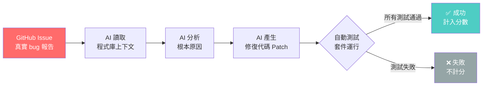

# SWE-bench 與 AI 編程能力評估方法論

> [!abstract] 一句話理解
> 這是一個用來「評估 AI 自動修復真實 GitHub Issue 能力」的基準測試框架，特別之處在於它用實際維護中的程式碼庫作為考題，讓 AI 無法靠「背答案」取得好成績，是目前最接近真實軟體工程工作場景的評估方法。

## 🎯 為什麼重要

**它解決了什麼問題？**

**問題一：傳統 AI 基準無法反映真實工程能力**

在 SWE-bench 出現之前，AI 的編程能力主要透過以下方式評估：
- **HumanEval**：給出函式說明，讓 AI 寫出一個函式
- **MBPP**：多選程式設計題，有明確的輸入輸出規格
- **LeetCode 風格題目**：算法題，有標準解法

這些基準的問題在於：它們測試的是「在受控環境下完成孤立函式」的能力，而真實軟體工程需要的是理解**整個程式庫的脈絡**、找出問題根源、跨多個檔案修改，並確保不破壞現有功能。

**問題二：高分模型在實際工程任務中表現不佳**

2023-2024 年間，許多 LLM 在 HumanEval 達到 90%+ 的高分，但在實際的程式修復任務中表現不穩定。工程師發現這些模型常常能「猜出答案」但無法真正「理解問題」。

**問題三：基準污染（Benchmark Contamination）**

隨著模型規模增大，訓練資料與測試題目重疊的問題越來越嚴重。模型可能「記住」了測試題目的正確答案，而非真正學會解題能力。

SWE-bench 的設計哲學是：使用**持續更新的真實 GitHub Issue**，讓記憶和背誦變得無效。

## 🧠 入門解說（用類比理解）

**用「醫師執照考試 vs. 實習門診」來理解**

傳統 AI 編程基準就像「醫師執照筆試」——準備得好、背熟教科書，就能拿高分。但實際的醫療工作需要面對活生生的病人：症狀複雜、可能有多種可能性、治療方案影響其他指標。

SWE-bench 就像「實習門診評估」：
- **病人（=真實 GitHub Issue）**：不是教科書裡的標準案例，是真實出現的、有時描述模糊的問題
- **病歷（=程式庫）**：包含幾萬行代碼，AI 必須先理解整個系統才能找到問題
- **治療（=程式修復）**：必須在不影響其他功能（=不破壞現有測試）的前提下解決問題
- **考官（=自動化測試套件）**：修復後運行所有測試，只要有一個測試失敗就算失敗

SWE-bench Pro 則是更難的版本，相當於「在人手不足的急診室值班」——問題更複雜、資訊更不完整、同時需要修改更多系統組件。

## 🔑 重點原理

1. **SWE-bench 的資料來源**：從真實 GitHub 倉庫抓取「已解決的 Issue + 對應的 Pull Request（修復 commit）」。這讓測試題目自動隨時間更新（新的 Issue 不斷出現），極難被記憶，同時提供了自動評分的機制（用人類工程師的修復作為黃金標準）。

2. **SWE-bench Verified vs. SWE-bench Pro 的差異**：
   - **SWE-bench Verified**（500 題）：來自知名的 12 個 Python 倉庫（Django、numpy、scikit-learn 等），已有多年歷史，部分問題可能已進入訓練資料
   - **SWE-bench Pro**（更難）：題目來自「主動維護中的倉庫」，需要修改多個檔案（multi-file diff），且**沒有公開的正確答案**。這使得記憶幾乎無效

3. **自動評分機制**：AI 提交修復代碼後，評估系統自動運行原始倉庫的測試套件。若 AI 的修復讓所有測試通過（或讓原本失敗的測試變成通過，且不引入新的失敗），才算成功。這是最接近工程師實際工作的評估方式。

4. **Claude Opus 4.8 的 SWE-bench 策略**：Anthropic 的模型在此基準上表現出色，原因在於：(a) 長上下文理解能力——能讀取更多相關程式碼；(b) 動態工作流程（Dynamic Workflows）——遇到錯誤時能自動調整策略而非中止；(c) 工具調用精準度——正確呼叫文件系統工具搜尋相關程式碼。

5. **GPQA Diamond 基準**：與 SWE-bench 不同，GPQA Diamond 測試的是「研究生水準的跨領域推理」（物理、化學、生物）。Claude Mythos Preview 的 94.6% 成績，代表其推理深度已達到、甚至超越大多數博士生。這兩個基準分別衡量「實用工程能力」和「深層推理能力」，是互補的評估維度。

## 📊 視覺化說明

### SWE-bench 評估流程

### 各 AI 模型 SWE-bench Pro 比較表

| 模型 | 開發者 | SWE-bench Pro | SWE-bench Verified | 是否開源 | 成本（輸入/M tokens）|
|---|---|---|---|---|---|
| **Claude Opus 4.8** | Anthropic | **69.2%** | **88.6%** | 否 | $5 |
| Claude Opus 4.7 | Anthropic | 64.3% | 87.6% | 否 | $5 |
| GPT-5.5 | OpenAI | 58.6% | — | 否 | 未公布 |
| Kimi K2.6 | Moonshot AI | 58.6% | — | **是** | **$0.14** |
| Gemini 3.1 Pro | Google | 54.2% | 80.6% | 否 | 較高 |

## 🔍 與既有技術的差異

**vs. HumanEval / MBPP（傳統編程基準）**

HumanEval 和 MBPP 使用人工設計的獨立問題，有明確的輸入/輸出規格。SWE-bench 的問題來自真實程式庫，涉及理解複雜的系統依賴關係。前者更像「筆試」，後者更像「實戰演練」。

**vs. Agentic Benchmarks（代理 AI 基準）**

Terminal-Bench、MCP Atlas 等代理 AI 基準評估的是「在終端機/工具環境中完成長周期任務」的能力，與 SWE-bench 有重疊（都需要工具使用能力），但 Terminal-Bench 更側重「環境交互」，SWE-bench 更側重「程式碼理解與修復」。

**SWE-bench Pro vs. SWE-bench Verified**

- SWE-bench Verified 已成為「標準」，但開始出現訓練資料污染的疑慮（部分題目已被廣泛研究）
- SWE-bench Pro 是「防污染升級版」，採用持續更新的問題集，對記憶的依賴幾乎無效
- 業界趨勢是以 SWE-bench Pro 作為更可信的能力指標

## 📚 關鍵詞對照表

| 中文 | 英文 | 簡短解釋 |
|---|---|---|
| 軟體工程基準 | Software Engineering Benchmark | 評估 AI 在真實工程任務上能力的測試集 |
| 基準污染 | Benchmark Contamination | 訓練資料包含測試題目，導致分數虛高 |
| 多檔案修改 | Multi-file Diff | 同時修改多個原始碼檔案的 AI 能力 |
| 黃金標準 | Ground Truth | 人類工程師撰寫的正確修復作為評分依據 |
| 測試套件 | Test Suite | 程式庫附帶的自動化測試，用於驗證修復正確性 |
| GPQA Diamond | Graduate-level Google-Proof Q&A | 博士生水準的跨領域難題，測試深層推理能力 |
| 動態工作流程 | Dynamic Workflows | AI 在執行任務時遇到錯誤可自動調整策略的能力 |

## 🛠️ 可能的應用場景

1. **自動化程式碼維護**：AI 持續監控 GitHub Issue 佇列，自動生成修復 PR，工程師只需審查
2. **技術債清理**：AI 掃描舊版程式庫的已知問題，批次生成修復建議
3. **新員工 Onboarding 輔助**：AI 幫助新進工程師理解大型程式庫，自動解答「這個函式在哪裡？」類型的問題
4. **CI/CD 流水線智能化**：測試失敗時 AI 自動分析原因並嘗試修復，而非單純發出告警
5. **安全漏洞修補**：AI 結合安全掃描工具，自動生成 CVE 對應的補丁代碼

## 📖 學習路徑建議

1. **先讀**：基礎 Python 編程與 Git 版本控制概念（理解 PR、commit、diff 的含義）
2. **再讀**：SWE-bench 原始論文——《SWE-bench: Can Language Models Resolve Real-World GitHub Issues?》（2023）
3. **再讀**：本篇對應的新聞筆記，了解 Claude Opus 4.8 的完整評測背景
4. **進階**：SWE-bench Pro 的評估設計文件，理解「防污染」機制的技術細節
5. **進階**：LLM 在代理任務中的工具使用策略（ReAct / Tool Use / Function Calling）

## 🔗 延伸閱讀
- 原文連結：[Vellum AI - Claude Opus 4.8 Benchmarks Explained](https://www.vellum.ai/blog/claude-opus-4-8-benchmarks-explained)
- 對應新聞筆記：[[2026-06-02-Claude Opus 4.8 SWE-bench Pro達69.2%全面領先競品基準解析]]
- LLM Stats 排行榜：[llm-stats.com](https://llm-stats.com/leaderboards/llm-leaderboard)
- TrueFoundry SWE-bench Pro 實測：[truefoundry.com](https://www.truefoundry.com/blog/claude-opus-4-8-and-swe-bench-pro-we-ran-anthropics-headline-through-our-gateway)

---
*由 Claude 自動整理於 2026-06-02*
