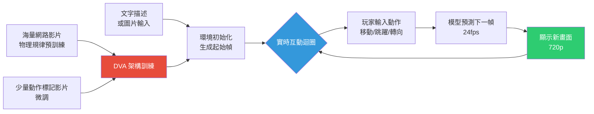

# 世界模型（World Model）：Genie 3 與實時互動 3D 環境生成

> [!abstract] 一句話理解
> 這是一個用來「讓 AI 理解並模擬物理世界運作規律，並即時生成可互動環境」的模型，特別之處在於它透過觀看海量網路影片自學物理法則，不需要昂貴的機器人資料標註，就能創造出玩家可以走進去探索的 3D 世界。

## 🎯 為什麼重要

**它解決了什麼問題？**

**問題一：影片生成 AI「能看不能玩」**

Sora、Runway Gen-3 等影片生成 AI 只能輸出「被動影片」，用戶按下播放只能觀看，無法改變劇情或探索環境。傳統遊戲引擎（Unity、Unreal Engine）可以生成互動環境，但需要專業開發者手動建模、設計物理規則，開發成本極高。

**問題二：機器人訓練資料極度稀缺**

自動駕駛和機器人的訓練需要大量「包含動作標記的視覺資料」——車子在雨天如何應對行人突然衝出？機械臂在不同材質表面的抓取力道如何調整？這類邊緣場景（Edge Cases）在現實中出現頻率極低，收集成本高昂。

**問題三：3D 環境模擬需要人工建模**

工業模擬、建築視覺化、數字孿生的傳統做法，都需要工程師花費數週時間建立精確的 3D 模型。「從照片描述直接生成可互動場景」是長期未解的挑戰。

Genie 3 同時挑戰這三個問題——它生成的環境是互動的、是從影片自學的、也不需要人工建模。

## 🧠 入門解說（用類比理解）

**用「看電影學開車 vs. 開模擬器」來理解**

**傳統影片 AI（如 Sora）**：
就像你看了 1,000 部賽車電影，你能想像出一部「看起來很真實的賽車影片」，但你實際上不懂物理——車子為什麼會飄移、急煞時為什麼會偏向一側。

**Genie 3（世界模型）**：
就像你看了 1,000 部賽車電影「之後，再實際開了幾次模擬器」——你不只能想像影片，你還能預測「如果玩家踩油門，下一秒車子會去哪」、「如果撞到牆，車子的反彈方向是什麼」。

**直接影片動作（DVA）架構的類比**：

1. **預訓練**（看電影）：模型看了數億部網路影片，學到物理常識：物體在重力下怎麼落下、球彈跳的軌跡、火焰如何擴散...
2. **微調**（開模擬器）：用少量「包含動作標記的影片」（如遊戲操控錄影、機器人手臂動作）微調，讓模型學會「玩家按左鍵時，場景中的物體應該如何移動」
3. **閉環推理**（實時駕駛）：玩家在探索時，每一幀都是一個「給定玩家的動作，預測下一幀」的推理任務，形成持續的互動循環

## 🔑 重點原理

1. **自回歸生成 + 動作條件（Action-Conditioned Autoregressive Generation）**：Genie 3 本質上是一個「動作條件視訊預測模型」——給定當前的環境幀（Frame）和玩家的動作指令，模型預測下一幀。24fps 的即時體驗意味著模型每秒要做 24 次這樣的預測。這對模型的推理速度和一致性要求極高。

2. **Direct Video Action（DVA）架構**：DVA 是 Genie 3 的核心訓練方法。在預訓練階段，模型從「無標注的大量影片」中學習物理世界如何運動；關鍵突破是讓模型在無動作標記的影片上也能推斷「是什麼動作導致了這個畫面的變化」——就像從影片的前後幀推斷中間發生了什麼。這大幅降低了對昂貴動作標記資料的依賴。

3. **空間一致性（Spatial Consistency）與其限制**：Genie 3 能在數分鐘內維持一致的環境狀態——你向左轉，看到的世界仍是「那個世界」的延伸，而非隨機生成的新場景。但目前一致性只能維持數分鐘，更長的探索可能導致環境「漂移」（物件消失或變形）。這是世界模型當前最核心的技術限制。

4. **Waymo World Model（WWM）的實作邏輯**：Waymo 採用 Genie 3 微調版本的原理：自動駕駛系統需要應對「罕見但危險的場景」（邊緣案例），但這些場景在現實中極少出現。WWM 可以讓 Waymo 工程師用文字描述需要的邊緣場景（「一個騎腳踏車的人突然從卡車後方竄出」），系統自動生成可模擬的 3D 場景，自動駕駛演算法在這些合成場景中反覆訓練，而無需等待現實中罕見事件的發生。

5. **Street View 整合的技術意義**：Genie 3 + Google Street View 的整合，讓「靜態 2D 全景圖 → 動態可探索 3D 環境」成為可能。技術上，Genie 3 用 Street View 的照片作為「初始環境幀」，然後推理「如果你往前走一步，下一幀應該是什麼」，形成可行走的虛擬實境體驗。

## 📊 視覺化說明

### Genie 3 生成流程

### 世界模型 vs. 影片生成模型 vs. 傳統遊戲引擎比較

| 維度 | 影片生成模型（Sora）| Genie 3（世界模型）| 傳統遊戲引擎（Unity）|
|---|---|---|---|
| 輸出性質 | 被動影片 | 可互動環境 | 可互動環境 |
| 建立方式 | 文字提示→影片 | 文字/圖片→互動世界 | 人工建模→程式設計 |
| 物理準確性 | 視覺逼真但不嚴謹 | 基本遵循物理規律 | 精確可設定 |
| 開發時間 | 秒級（生成）| 秒級（生成）| 數週至數月 |
| 使用者互動 | 無（一次性輸出）| 有（實時回應）| 有（精確控制）|
| 持久一致性 | 數秒至數分鐘 | 數分鐘 | 無限（設計者決定）|
| 適合用途 | 影片創作、廣告 | 快速原型、機器人訓練 | 正式遊戲、工業模擬 |

## 🔍 與既有技術的差異

**vs. 傳統影片生成（Sora、Runway）**

最本質的差異是「互動性」：Sora 生成的影片無論多逼真，玩家都無法介入改變劇情。Genie 3 生成的環境是一個「活的場景」，玩家的每個動作都會改變後續的生成內容。

**vs. Genie 1 / Genie 2（前代產品）**

Genie 1（2024）主要能生成 2D 遊戲風格的互動場景，解析度和幀率有明顯限制；Genie 2（2025）擴展到 3D，但持久一致性仍然薄弱。Genie 3 的突破在於 24fps / 720p 達到接近流暢的實時體驗，以及更長的空間一致性維持時間。

**vs. NVIDIA Omniverse（工業元宇宙平台）**

Omniverse 是傳統「人工建模 + 精確物理引擎」的路線，適合高精度工業模擬（製造業數位孿生）。Genie 3 是「AI 生成 + 學習物理」的路線，速度更快、門檻更低，但精度和可控性不及 Omniverse。兩者目前針對不同市場，但未來可能融合。

## 📚 關鍵詞對照表

| 中文 | 英文 | 簡短解釋 |
|---|---|---|
| 世界模型 | World Model | 能模擬物理世界運作的 AI 模型 |
| 直接影片動作 | Direct Video Action (DVA) | Genie 3 從無標注影片學習物理的訓練方法 |
| 動作條件生成 | Action-Conditioned Generation | 根據玩家動作預測下一幀的生成機制 |
| 閉環控制 | Closed-loop Control | 模型輸出直接影響下一輸入，形成持續互動迴圈 |
| 邊緣案例 | Edge Case | 在現實中罕見但重要的極端情境 |
| 空間一致性 | Spatial Consistency | 在探索過程中環境保持連貫的能力 |
| 自回歸生成 | Autoregressive Generation | 每次預測下一個 token/幀，基於之前所有輸出 |

## 🛠️ 可能的應用場景

1. **自動駕駛 / 機器人邊緣場景訓練**：Waymo 的案例最具代表性。任何需要應對罕見危險場景的自動化系統，都可以用 Genie 3 無限生成合成訓練資料。

2. **遊戲關卡快速原型**：遊戲開發者可以用文字描述快速生成可玩的關卡原型，測試玩法感受後再決定是否投入正式資源開發。

3. **虛擬旅遊與建築視覺化**：結合 Street View / 建築 CAD 圖，讓客戶在建築建成前就能「走進去」體驗空間感受。

4. **教育模擬環境**：歷史場景重建（如古羅馬廣場、二戰戰場）可以讓學生身臨其境地探索，而非只看靜態圖片。

5. **心理治療情境曝露**：特定恐懼症的漸進曝露治療（如高空恐懼、社交焦慮），可以用 Genie 3 即時生成客製化的情境，比預錄 VR 影片更靈活。

## 📖 學習路徑建議

1. **先讀**：「什麼是 Transformer 視覺模型（Vision Transformer）」——理解 Genie 3 的輸入/輸出如何被編碼
2. **再讀**：影片預測模型（Video Prediction）的基礎概念，了解「給定當前幀，預測下一幀」的自回歸生成原理
3. **再讀**：本篇對應的新聞筆記，了解 Genie 3 的實際應用場景
4. **進階**：Genie 1 原始論文（Google DeepMind, 2024）——理解 DVA 架構的完整技術細節
5. **進階**：World Models in Robotics（相關綜述論文），了解世界模型如何被用於機器人策略學習

## 🔗 延伸閱讀
- 原文連結：[Google DeepMind Genie 3 部落格](https://deepmind.google/blog/genie-3-a-new-frontier-for-world-models/)
- 對應新聞筆記：[[2026-06-03-Google DeepMind Genie 3世界模型實時互動3D環境]]
- Genie 官方頁面：[deepmind.google/models/genie](https://deepmind.google/models/genie/)
- WaveSpeed AI 技術解析：[wavespeed.ai](https://wavespeed.ai/blog/posts/google-deepmind-genie-3-world-model-2026/)
- Labellerr 深度分析：[labellerr.com](https://www.labellerr.com/blog/genie-3-google-deepmind-world-model/)

---
*由 Claude 自動整理於 2026-06-03*
