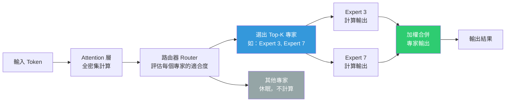

# 稀疏混合專家（Sparse MoE）推理模型架構

> [!abstract] 一句話理解
> 這是一個用來「讓超大型 AI 模型以更低計算成本運行」的架構，特別之處在於它把模型的「知識」分配給數百個「專家」子網路，每次處理時只啟動少數最合適的專家，而不是啟動整個模型——就像一間公司不讓所有員工同時上班，只叫需要的人來。

## 🎯 為什麼重要

**它解決了什麼問題？**

**問題一：模型越大越好，但算力不夠用**

AI 語言模型的性能與參數量高度相關。過去幾年的研究（Scaling Laws）持續證明：更多參數 → 更好的語言理解和推理能力。然而，一個 1 兆參數的密集模型（Dense Model）每次生成一個 token 時，都需要啟動所有 1 兆個參數，計算量和記憶體需求極為龐大，使得推理成本居高不下。

**問題二：密集模型的邊際成本線性增長**

傳統密集模型（如早期版本的 GPT-3）的推理成本與參數量成正比。這意味著要從 700B 參數擴充到 1T 參數，推理成本也會同步增加 40%——讓規模擴展越來越昂貴。

**問題三：如何兼顧「大容量」與「低成本」**

MoE 的目標是：在擁有 1 兆總參數的同時，每次推理只啟動其中一小部分（如 35B），讓模型「擁有廣博的知識，但每次思考只調用需要的部分」。

MAI-Thinking-1 的選擇——35B 活躍 / ~1T 總參數——代表了 2026 年業界主流的 Sparse MoE 設計平衡點。

## 🧠 入門解說（用類比理解）

**用「大型顧問公司」來理解 Sparse MoE**

想像一家有 1,000 名顧問的公司（= 1T 總參數的 MoE 模型）：

- **每個顧問**是一位「專家」，精通特定領域（財務、技術、法律、行銷...）
- **公司接到專案**（= 收到一個語言生成任務）時，專案調度員（= 路由器 Router）評估這個問題需要哪些專家
- 對於一個財務法規問題，調度員只召集財務顧問和法律顧問（= 35B 活躍參數），而非讓所有 1,000 人都來開會
- 最終輸出是這幾位被選中的專家合作給出的建議

**對比傳統密集模型（Dense Model）**：

傳統模型就像一個公司每次接案子，都要讓所有 1,000 名顧問全部出席開會，效率極低（計算成本高），但確保每個問題都有最完整的知識集合參與。

MoE 的賭注是：大多數問題其實不需要所有人，只需要最相關的幾個人就夠了。

## 🔑 重點原理

1. **稀疏路由（Sparse Routing）**：MoE 模型的核心是一個「路由器（Router）」，負責決定每個 token 的處理應該由哪 K 個專家處理（通常 K=2 或 K=8）。路由器本身是一個輕量的神經網路，輸出每個專家被選中的概率，選取 Top-K 的專家。只有被選中的專家的參數才會被載入計算，其餘休眠。

2. **專家（Expert）的結構**：在 Transformer 架構中，MoE 通常替換「前饋網路層（FFN）」的部分，改為多個平行的 FFN 子網路，每個就是一個「專家」。Attention 層（注意力機制）通常仍保持密集（Dense），因為它負責理解 token 之間的關係，需要全局視野。

3. **負載均衡（Load Balancing）**：如果路由器偏向總是選擇同幾個專家，其他專家就變成「擺設」，等於浪費了參數。訓練時需要引入「負載均衡損失（Auxiliary Loss）」，強制路由器均勻分配任務給各個專家，確保每個專家都能「得到訓練」。

4. **MAI-Thinking-1 的推理特化設計**：除了 MoE 基礎架構，MAI-Thinking-1 是「推理模型（Reasoning Model）」，訓練過程中特別強化了「思維鏈（Chain-of-Thought）」能力。模型在回答問題前，會先生成一系列「思考步驟」，類似人類解題時打草稿，然後再輸出最終答案。這讓它在 AIME（數學推理）等需要多步推演的任務上表現出色。

5. **「零蒸餾原則」的技術意義**：微軟聲稱 MAI-Thinking-1 未使用 OpenAI 模型的輸出進行蒸餾訓練。知識蒸餾（Knowledge Distillation）是讓小模型學習大模型輸出的技術，能快速提升小模型的表現，但依賴母模型的知識。「零蒸餾」意味著模型的所有能力都來自原始訓練資料，不依賴 OpenAI 的知識遺產——這是技術獨立的象徵，也帶來更高的訓練難度。

## 📊 視覺化說明

### MoE 推理流程

### Dense vs. Sparse MoE 比較表

| 維度 | 密集模型（Dense） | 稀疏 MoE |
|---|---|---|
| 每次推理啟動參數 | 100%（全部）| 3–10%（Top-K 專家）|
| 推理計算量 | 與參數量成正比 | 遠低於參數量 |
| 總參數容量 | 受算力限制（通常 < 100B） | 可達 1T+ |
| 訓練難度 | 較低 | 較高（需要負載均衡）|
| 適合任務 | 通用 | 多樣化任務（不同問題派不同專家）|
| 代表模型 | LLaMA 3, GPT-3.5 | GPT-4, MAI-Thinking-1, Mixtral |

## 🔍 與既有技術的差異

**vs. 密集模型（Dense Model，如 LLaMA 3）**

密集模型每個 token 的計算量等比例於參數量；Sparse MoE 的計算量與「活躍參數量」成正比，即使總參數達 1T，推理成本可以等同於一個 35B 的密集模型。代價是訓練和部署的複雜度更高。

**vs. 之前的 MoE 實作（如 Mixtral 8x7B）**

Mixtral 8x7B 是 2023–2024 年的 MoE 代表作：8 個 7B 專家，每次選 2 個，約 13B 活躍參數，46B 總參數。MAI-Thinking-1 的規模（35B 活躍 / 1T 總）比 Mixtral 大了整整一個數量級，代表 MoE 架構在更大規模上的驗證。

**vs. 知識蒸餾（Knowledge Distillation）方法**

蒸餾是用大模型輸出訓練小模型，在計算資源受限時非常有效，但依賴母模型的品質。MAI-Thinking-1 選擇「從頭訓練」，在自主性上更強，但需要更多原始計算資源。

## 📚 關鍵詞對照表

| 中文 | 英文 | 簡短解釋 |
|---|---|---|
| 稀疏混合專家 | Sparse Mixture of Experts (Sparse MoE) | 每次推理只啟動部分專家子網路的架構 |
| 路由器 | Router | 決定將每個 token 分配給哪些專家的輕量網路 |
| 活躍參數 | Active Parameters | 每次推理實際計算的參數量 |
| 負載均衡 | Load Balancing | 確保各專家均勻被使用的訓練機制 |
| 知識蒸餾 | Knowledge Distillation | 用大模型輸出訓練小模型的技術 |
| 推理模型 | Reasoning Model | 訓練時特別強化思維鏈能力的 LLM |
| 思維鏈 | Chain-of-Thought (CoT) | 回答前先生成多步驟推理過程的技術 |
| 密集模型 | Dense Model | 每次推理啟動所有參數的傳統 LLM 架構 |

## 🛠️ 可能的應用場景

1. **高推理需求、低成本要求的企業場景**：MoE 架構讓企業可以部署「接近 1T 參數的大腦」但只付「35B 參數的算力費」，適合法律文件分析、財報解讀等需要深度推理的任務。

2. **多工支援型代理（Multi-task Agent）**：MoE 的「不同問題派不同專家」特性，天然適合代理 AI 場景——代理面對的任務多樣化（程式碼、法律、數學、創意寫作），MoE 可以在同一個模型中高效處理。

3. **本機邊緣端部署**：未來更激進的 MoE 設計（如每次只啟動 1–3B 參數），可能讓 1T 參數的大型模型在邊緣裝置上運行成為可能。

4. **科學研究推理**：MAI-Thinking-1 在 AIME 上的 97% 表現，顯示 MoE + CoT 的組合特別適合數學和科學推理任務，可應用於材料科學、藥物設計等領域的 AI 輔助研究。

5. **代碼生成與調試**：MAI-Code-1-Flash（同期發布的 MoE 系列成員）整合至 GitHub Copilot，代表 MoE 模型在程式碼生成上的規模化應用。

## 📖 學習路徑建議

1. **先讀**：Transformer 基礎架構（Attention Mechanism、FFN 層的作用）——理解 MoE 替換的是哪個部分。
2. **再讀**：Mixtral 8x7B 論文（Mistral AI, 2023）——MoE 在大型語言模型上的第一個廣泛驗證案例，架構相對簡單。
3. **再讀**：本篇對應的新聞筆記——了解 MAI-Thinking-1 在 2026 年實際產品中的應用背景。
4. **進階**：Switch Transformer 論文（Google, 2021）——MoE 在 Transformer 中的奠基性研究，解釋負載均衡的設計原則。
5. **進階**：OpenAI GPT-4 技術報告（2023）——雖然參數架構未完整披露，但理解 1T+ 規模 MoE 的設計理念。

## 🔗 延伸閱讀
- 原文連結：[TechTimes - MAI-Thinking-1](http://www.techtimes.com/articles/317631/20260602/microsoft-build-2026-mai-thinking-1-first-house-reasoning-model-trained-without-openai-data.htm)
- 對應新聞筆記：[[2026-06-03-Microsoft MAI-Thinking-1自研推理模型Build2026發布]]
- Microsoft AI 官方頁面：[microsoft.ai/models/mai-thinking-1](https://microsoft.ai/models/mai-thinking-1/)
- ChatForest MAI-Code-1-Flash 分析：[chatforest.com](https://chatforest.com/builders-log/microsoft-mai-code-1-flash-github-copilot-coding-model-build-2026/)

---
*由 Claude 自動整理於 2026-06-03*
