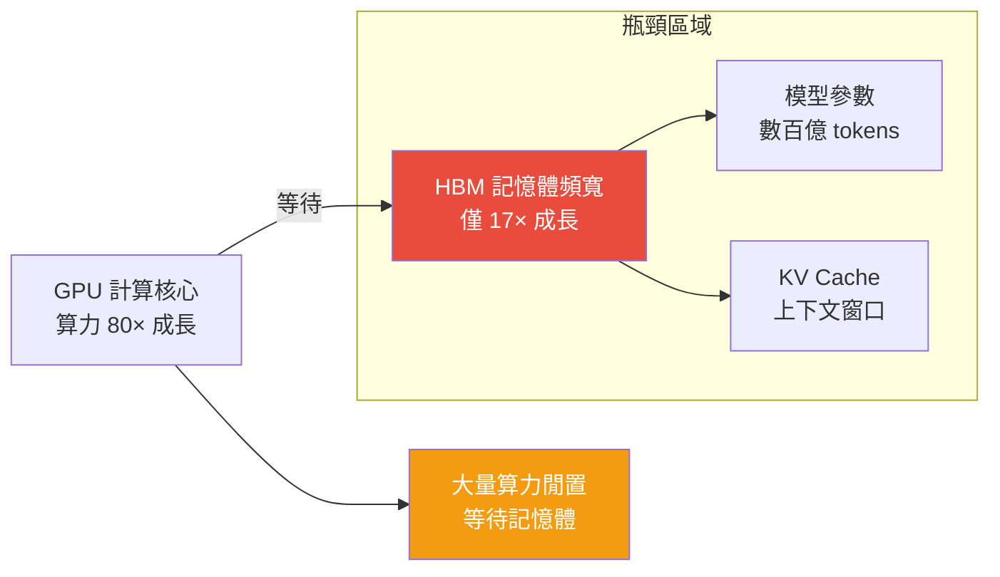

# LLM 推理硬體瓶頸與四大架構機遇

> [!abstract] 一句話理解
> 這是一套用來「解釋為什麼現在的 AI 晶片在跑 LLM 時效率不足，以及下一代如何解決」的硬體架構框架，特別之處在於它由圖靈獎得主 David Patterson（RISC 之父）主筆，指出 LLM 推理的核心瓶頸已從「算力不夠」轉移到「記憶體頻寬不夠」，這是一個和傳統 CPU/GPU 加速截然不同的問題。

## 🎯 為什麼重要

**它解決了什麼問題？**

**問題一：AI 晶片的「速度快但搬運慢」困境**

想像一座城市的公路（算力）已經建得超寬超快，但進城的橋樑（記憶體頻寬）卻沒有相應拓寬——結果就是公路空著，貨車都在橋前大排長龍。這正是 2026 年 LLM 推理硬體的現狀：

- AI 晶片算力：過去十年成長 **80×**
- 記憶體頻寬：同期僅成長 **17×**
- 結果：大量算力閒置，等待記憶體傳輸資料

**問題二：LLM 推理是「記憶體受限」工作負載**

LLM 生成每個 token 的過程是**自回歸的**——每次只生成一個 token，但需要讀取整個模型的所有參數。一個 70B 參數模型，每生成一個 token 都要讀取約 140GB 資料（FP16 格式）。這與訓練階段（計算密集，算力是瓶頸）截然不同。

**問題三：如何在不浪費算力的情況下提升推理效率**

傳統方案：買更多 GPU 來並行處理。但這只能提升吞吐量（同時處理更多請求），無法降低單次推理的延遲。解法需要從根本上改變記憶體的容量和頻寬特性。

## 🧠 入門解說（用類比理解）

**用「廚師做菜」理解 LLM 推理的硬體問題**

想像一位廚師（GPU 算力）的刀工很快，但食材倉庫（HBM 記憶體）太遠：
- 每做一道菜（生成一個 token），廚師都要跑去倉庫取完整的一套食材（讀取所有模型參數）
- 廚師的刀功（算力）再快，大部分時間都在跑路（等待記憶體）
- 「算力」這個廚師每天有 80% 的時間在等資料，只有 20% 在真正「做菜」

**四大機遇的類比：**
- **HBF（高頻寬快閃記憶體）**：在廚房旁邊建更大的臨時儲藏間，放得下更多食材，不用跑遠處的倉庫
- **PNM（近記憶體處理）**：直接在倉庫裡安裝刀具，不用把食材搬到廚房
- **3D 堆疊**：把廚房（計算）直接建在倉庫頂層，徹底消除搬運距離
- **低延遲互連**：多間廚房（多個 GPU）之間的傳菜通道從小巷升級為高速公路

## 🔑 重點原理

1. **記憶體階層（Memory Hierarchy）與 LLM 的衝突**：現代 AI 系統有多層記憶體：SRAM（最快但最貴，在晶片上）→ HBM（高頻寬記憶體，在封裝上）→ DRAM（系統記憶體）→ 儲存（SSD）。LLM 推理需要頻繁存取的 KV Cache（鍵值快取）和模型參數，規模遠超 SRAM 容量，必須存在 HBM 或更低階，造成頻寬瓶頸。

2. **自回歸解碼（Autoregressive Decoding）的算術強度**：算術強度（Arithmetic Intensity）= 計算量 / 記憶體存取量。訓練時算術強度高（一批次資料反覆計算），推理的自回歸解碼階段算術強度極低（讀一次用一次），使推理在本質上是「記憶體受限（Memory Bandwidth-Bound）」。

3. **高頻寬快閃記憶體（HBF）的原理**：現有 HBM 基於 DRAM 技術，密度受限，一個封裝最多幾百 GB。HBF 目標是利用 3D NAND 快閃記憶體的高密度特性，結合高速介面，提供接近 HBM 頻寬但有 10× 容量的記憶體，讓單節點可以容納千億參數模型。

4. **近記憶體處理（PNM）的革命性意義**：PNM 將計算單元移至記憶體旁邊甚至記憶體內部，資料不需要離開記憶體子系統就能完成計算。對 LLM 推理最有用的操作（矩陣-向量乘法，即模型的主要計算）可以在 PNM 中高效執行，大幅降低資料搬運成本。

5. **3D 記憶體-邏輯堆疊的突破**：進一步將計算邏輯（矩陣乘法加速核心）直接整合到記憶體晶粒堆疊中，消除計算和記憶體之間最後的物理距離，理論上可以實現接近「記憶體頻寬上限」的算術吞吐量。

## 📊 視覺化說明

### LLM 推理硬體瓶頸示意

### 四大架構機遇比較表

| 機遇 | 核心改進 | 主要優勢 | 主要挑戰 | 成熟度 |
|---|---|---|---|---|
| HBF（高頻寬快閃記憶體）| 記憶體容量 10× | 大模型單節點部署 | 頻寬需達到 HBM 水準 | 研究階段 |
| PNM（近記憶體處理）| 計算移至記憶體旁 | 大幅降低資料搬運 | 程式設計複雜度高 | 早期原型 |
| 3D 記憶體-邏輯堆疊 | 計算與記憶體一體 | 最接近理論上限 | 製程難度極高 | 概念驗證 |
| 低延遲互連 | 節點間通訊加速 | 分散式推理效率 | 成本與部署複雜度 | 逐步成熟 |

## 🔍 與既有技術的差異

**vs. 傳統 GPU 算力提升路線**

傳統的 AI 加速思路（NVIDIA 的 Volta→Ampere→Hopper 架構演進）主要在提升每秒浮點運算（FLOPS）。Google 的研究指出這條路線對 LLM 推理的邊際收益遞減——算力已夠快，瓶頸在其他地方。

**vs. 模型量化（Quantization）和知識蒸餾**

量化（將 FP16 壓縮為 INT8/INT4）可以在現有硬體上減少記憶體需求，是短期解法。PNM 和 HBF 是長期硬體架構解法，理論上能解決量化無法解決的根本頻寬問題。

**vs. KV Cache 壓縮（如 mHC 技術）**

KV Cache 壓縮是軟體層的記憶體管理優化，而 HBF/PNM 是硬體層的根本解法。兩者互補——在新硬體成熟前，軟體優化是主要手段；硬體架構突破後，可以一起使用以達到更高效能。

## 📚 關鍵詞對照表

| 中文 | 英文 | 簡短解釋 |
|---|---|---|
| 記憶體頻寬 | Memory Bandwidth | 每秒記憶體與 CPU/GPU 之間的資料傳輸量 |
| 算術強度 | Arithmetic Intensity | 計算量相對於記憶體存取量的比值 |
| 高頻寬記憶體 | HBM (High Bandwidth Memory) | 現代 AI 晶片使用的高頻寬堆疊記憶體 |
| KV 快取 | KV Cache | 注意力機制中儲存 Key/Value 的中間結果 |
| 近記憶體處理 | Processing-Near-Memory (PNM) | 將計算單元放置在記憶體旁的架構 |
| 自回歸解碼 | Autoregressive Decoding | LLM 逐 token 生成的推理方式 |
| 記憶體受限 | Memory Bandwidth-Bound | 工作負載的效能由記憶體頻寬決定而非算力 |
| 高頻寬快閃記憶體 | High Bandwidth Flash (HBF) | 結合快閃記憶體高密度與近 HBM 頻寬的新型記憶體 |

## 🛠️ 可能的應用場景

1. **LLM 服務成本優化**：透過理解記憶體瓶頸，雲端 AI 服務業者可以更精準評估硬體投資的 ROI，優先選擇提升記憶體頻寬而非純算力的升級方案。

2. **邊緣端 LLM 部署**：HBF 如果商業化，可能讓消費者設備（高階手機、筆電）在本地運行更大規模的模型，推動「本地隱私 AI」發展。

3. **AI 基礎設施採購決策**：CTO/CIO 了解這四大機遇後，可以在評估 AI 伺服器採購時，除了看 FLOPS 還要問「記憶體頻寬是多少」、「是否支援 PNM 加速」。

4. **AI 晶片投資評估**：投資人在評估 AI 晶片新創時，可以用「是否解決記憶體頻寬瓶頸」而非「是否有更多 FLOPS」作為差異化評估維度。

5. **AI 服務定價與成本模型**：LLM 服務的成本主要由記憶體頻寬（非算力）決定，理解這一點有助於更精確地建立 AI 服務的成本與定價模型。

## 📖 學習路徑建議

1. **先讀**：計算機架構基礎——馮·諾依曼架構、記憶體階層（Cache、RAM、Storage）的基本概念。
2. **再讀**：Transformer 架構的注意力機制（Attention）——理解 KV Cache 是什麼、為什麼推理時需要大量記憶體。
3. **再讀**：本篇對應的新聞筆記——結合 Google 研究的實際背景，理解問題的產業意義。
4. **進階**：Roofline Model——了解算術強度如何決定工作負載是否受算力或記憶體限制，這是理解 LLM 推理瓶頸的核心框架。
5. **進階**：Google 原始論文 arXiv 2601.05047——完整閱讀 David Patterson 等人的技術分析和實驗數據。

## 🔗 延伸閱讀
- 原文連結：[Semiconductor Engineering 分析](https://semiengineering.com/four-architectural-opportunities-for-llm-inference-hardware-google/)
- 對應新聞筆記：[[2026-06-04-Google研究LLM推理硬體四大架構機遇記憶體成首要瓶頸]]
- arXiv 原始論文：[2601.05047](https://arxiv.org/abs/2601.05047)
- 延伸：LLM 推理記憶體瓶頸解析 [Medium](https://medium.com/coding-nexus/how-will-trillion-parameter-models-work-hardware-fixes-for-llm-inference-30253c0d6f6f)

---
*由 Claude 自動整理於 2026-06-04*
