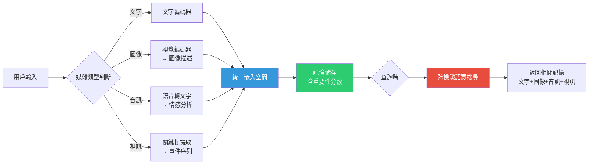

# OmniMem：多模態代理長期記憶架構與自動研究管線

> [!abstract] 一句話理解
> 這是一個用來「讓 AI 代理長期記憶跨文字、圖像、音訊、視訊等不同媒體類型」的框架，特別之處在於它不是由人類研究員設計的，而是由一個名為 AutoResearchClaw 的 23 階段自動研究管線自主發現的——AI 自己設計了讓 AI 更聰明的系統。

## 🎯 為什麼重要

**它解決了什麼問題？**

**問題一：AI 代理在長對話中「失憶」**

想像你每天和 AI 助理對話，分享你的照片、語音備忘和文字筆記。三個月後你問它：「你還記得我上個月說的那件事嗎？」對大多數 AI 代理來說，答案是否定的——它們的「記憶」僅限於當前對話視窗（通常數千到數萬個 token）。

這個問題在企業 AI 代理中更嚴重：客服代理需要記住用戶的歷史問題、研究助理需要關聯不同來源的知識片段、個人助理需要在多月的互動中維持連貫的用戶模型。

**問題二：現有記憶方案只支援文字**

目前主流的代理記憶方案（如 MemGPT、A-MEM、Mem0）都以文字為核心，無法處理圖像截圖、語音訊息、影片片段等非文字媒體。但現實世界的互動中，這些媒體佔了相當比例——用戶在討論設計稿時分享圖片，在解釋問題時傳送語音，在記錄工作時截圖。

**問題三：人工設計記憶架構太慢**

要設計一個多模態記憶系統，研究員需要手動：確定各媒體的特徵萃取方案、設計統一嵌入空間、選擇記憶組織結構、實作重要性評分機制...每一步都需要大量試錯。這種人工迭代週期長、探索空間受限。

**OmniMem 和 AutoResearchClaw 的答案**：讓 AI 系統自主設計並驗證這整套架構，在沒有人類介入的情況下執行約 50 次實驗，最終得出在兩個基準上大幅超越基線的方案。

## 🧠 入門解說（用類比理解）

**把 AI 代理的記憶比作「一個人的日記系統」**

傳統 AI 代理的記憶就像一個人只有一本文字日記，而且每頁只能看到最近幾頁（上下文視窗限制）。

OmniMem 想要建立的，是像一個整理得很好的生活記錄系統：
- **文字日記**（文字記憶）：記下重要事件和想法
- **相簿**（圖像記憶）：保存重要的視覺記錄，並用文字標注意義
- **語音備忘錄**（音訊記憶）：保存語氣和情感資訊
- **影片集錦**（視訊記憶）：保存動態過程

當你需要回憶「上個月的那次討論」時，系統會同時搜尋日記、相簿、語音備忘、影片，把所有相關記憶整合後呈現給你。

**AutoResearchClaw：讓 AI 自己成為記憶架構師**

如果說 OmniMem 是「好用的日記系統」，那 AutoResearchClaw 就是「自動設計這套系統的 AI 工程師」。它不是人工設計的，而是一個像流水線一樣自動運轉的研究機器：

```
提出假設 → 編寫程式碼 → 執行實驗 → 分析失敗 → 提出改進 → 重複...（約 50 次）
```

就像一個不知疲倦的工程師，24 小時自動試錯，最後找出最好的設計。

## 🔑 重點原理

1. **多模態攝取（Multimodal Ingestion）**：OmniMem 對每種媒體類型設計了獨立的處理管道。圖像透過視覺編碼器生成「這張圖在說什麼」的描述；音訊先轉文字再萃取情感特徵；視訊抽取關鍵幀並生成事件序列描述。每種媒體最終都被轉化成「可搜尋的語意表徵」。

2. **統一嵌入空間（Unified Embedding Space）**：不同模態的特徵被映射到同一個高維向量空間中。這讓「輸入一段文字，找到相關的圖像記憶」成為可能——因為語意上相關的文字和圖像，在這個空間裡的距離會很近。

3. **動態重要性評分（Dynamic Importance Scoring）**：不是所有記憶都一樣重要。OmniMem 維護每條記憶的「重要性分數」，根據訪問頻率、互動時的情感強度、用戶的後續引用行為動態調整，重要記憶被保留更久，不重要的逐漸淡出。

4. **記憶整合（Memory Consolidation）**：隨著時間累積，相關的短期記憶片段被自動合併成更高層次的「情節記憶」（Episodic Memory）——類似人類把多次類似體驗提煉為一個概括性印象，提高長期記憶的組織效率。

5. **AutoResearchClaw 的 23 階段架構**：這個自動研究管線涵蓋文獻調研→問題定義→假設生成→實驗設計→程式撰寫→執行→結果分析→失敗診斷→架構修改→重驗證等全流程，每個階段由不同的專業模組負責，輸出直接作為下一階段輸入，全程無人介入。

## 📊 視覺化說明

### OmniMem 多模態記憶流程



### OmniMem vs. 傳統記憶方案

| 維度 | 文字記憶（如 MemGPT）| OmniMem |
|---|---|---|
| 媒體支援 | 僅文字 | 文字、圖像、音訊、視訊 |
| 跨模態搜尋 | ✗ | ✓（文字查圖像等）|
| 重要性動態更新 | 部分支援 | 完整支援 |
| 設計方式 | 人工設計 | AI 自動研究管線發現 |
| LoCoMo F1 | ~0.117（基線）| 0.598（+411%）|
| Mem-Gallery F1 | ~0.254（基線）| 0.797（+214%）|

## 🔍 與既有技術的差異

**vs. MemGPT / A-MEM（文字記憶框架）**

MemGPT 等方案透過虛擬記憶系統讓 LLM 管理文字記憶，但完全不支援非文字媒體。OmniMem 在其基礎上擴展了多模態支援，並改進了記憶組織機制。

**vs. RAG（檢索增強生成）**

RAG 是在推理時從外部知識庫檢索文字文件，缺乏長期個人化記憶積累。OmniMem 關注的是「代理與特定用戶長期互動後形成的個人化記憶」，而非通用知識庫。

**vs. 多模態模型（Gemini、GPT-4o）**

多模態模型可以在單次對話中理解圖文混合輸入，但無法記憶跨對話的歷史媒體。OmniMem 解決的是「跨時間的多模態長期記憶」問題。

**AutoResearchClaw vs. 傳統 AI 研究**

最大差異在於「誰是研究員」。傳統研究：人類假設 → 人類設計實驗 → 人類分析結果。AutoResearchClaw：AI 假設 → AI 設計實驗 → AI 分析結果 → AI 修改設計，人類只定義最初的研究問題。

## 📚 關鍵詞對照表

| 中文 | 英文 | 簡短解釋 |
|---|---|---|
| 多模態代理記憶 | Multimodal Agent Memory | 能同時處理多種媒體類型的 AI 代理記憶系統 |
| 統一嵌入空間 | Unified Embedding Space | 將不同模態特徵映射到同一向量空間的技術 |
| 自動研究管線 | Automated Research Pipeline | 無需人類介入自主執行研究迭代的 AI 系統 |
| 情節記憶 | Episodic Memory | 對特定時間/情境的記憶，有別於語意知識 |
| 記憶整合 | Memory Consolidation | 將多個記憶碎片合併為高層次概括記憶的過程 |
| 重要性評分 | Importance Scoring | 衡量特定記憶值得長期保留的優先級指標 |
| 跨模態搜尋 | Cross-modal Retrieval | 以一種媒體類型查詢另一種媒體記憶（如文字找圖像）|
| 自回歸解碼 | Autoregressive Decoding | LLM 逐 token 生成輸出的推理方式 |

## 🛠️ 可能的應用場景

1. **個人化 AI 助理**：助理能記住你分享過的照片、說過的話、展示過的影片，在數月後的對話中自然引用，形成真正連貫的個人助理體驗。

2. **企業客服代理**：記憶用戶的歷史截圖、語音投訴、視訊示範，在後續互動中不需要重複描述問題背景。

3. **醫療 AI 助手**：記住患者的醫療影像（X 光、超音波）、語音描述症狀、文字記錄，跨越多次就診形成連續性健康記憶。

4. **教育 AI 導師**：記住學生在白板上畫的解題過程（圖像）、口頭解釋（音訊），跨課程追蹤學習進展。

5. **自動 AI 研究（AutoResearchClaw 的泛化應用）**：將同樣的「自動設計+迭代測試」管線應用於其他 AI 系統設計問題，如自動搜尋最佳 RAG 架構、自動設計提示工程策略。

## 📖 學習路徑建議

1. **先讀**：LLM 上下文視窗的基本概念——理解為什麼模型需要「外部記憶」補充（可搜尋 Context Window Limitations）。
2. **再讀**：MemGPT 論文（Packer et al., 2023）——理解文字記憶管理的基礎框架，OmniMem 在此基礎上擴展。
3. **再讀**：本篇對應的新聞筆記——了解 OmniMem 在 2026 年 AI 代理場景中的具體背景。
4. **進階**：Retrieval-Augmented Generation（RAG）的原理——理解記憶與知識檢索的關係與差異。
5. **進階**：自動機器學習（AutoML）和神經架構搜尋（NAS）領域文獻——了解 AutoResearchClaw 所屬的「AI 自動化研究」大方向。

## 🔗 延伸閱讀
- 原文連結：[arXiv OmniMem](https://arxiv.org/abs/2604.01007)
- 對應新聞筆記：[[2026-06-04-OmniMem自動研究管線發現多模態代理長期記憶框架]]
- 基礎框架 GitHub：[SimpleMem / aiming-lab](https://github.com/aiming-lab/SimpleMem)
- Hugging Face Papers：[OmniMem 頁面](https://huggingface.co/papers/2604.01007)

---
*由 Claude 自動整理於 2026-06-04*
