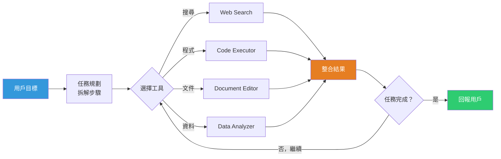

# GPT-5.5 代理架構設計與超任務完成能力

> [!abstract] 一句話理解
> 這是一個用來「在真實電腦環境中自主完成跨工具複雜任務」的代理語言模型，特別之處在於它是從頭完整重訓而非微調，對「工具呼叫時機、格式、跨工具連貫性」進行了深度優化，使 AI 首次能夠可靠地在 OSWorld 真實電腦操作（78.7%）和 Terminal-Bench 命令列任務（82.7%）中達到接近實用門檻的表現。

## 🎯 為什麼重要

**它解決了什麼問題？**

**問題一：AI 模型「做不完任務」**

在 GPT-5.5 之前，大多數語言模型即使具備工具呼叫（Function Calling）能力，也常在以下情境失敗：
- 需要 10 步以上的長鏈任務，中途偏離目標或忘記初始要求
- 在多個工具（搜尋→分析→寫作→格式→輸出）之間切換時，前後上下文不連貫
- 工具參數格式錯誤，導致呼叫失敗後無法自行修復

這讓「AI 代理」更像「AI 助理」——需要人類不斷介入和糾正。

**問題二：固定對話模式難以對應「真實工作場景」**

傳統 ChatGPT 交互模式是：用戶問→模型答→用戶問→模型答。但真實工作場景更像：
「幫我研究競爭對手→整理成分析報告→製作 PPT→用 Excel 計算市佔→發送郵件」

這個連貫任務涉及多個工具、多個步驟、跨越數十分鐘——不是「問答」而是「委派」。

**問題三：評估標準跟不上能力發展**

舊的基準（如 MMLU、HumanEval）只測單次回答能力，無法衡量代理能力。GPT-5.5 的發布伴隨著新一代代理基準（GDPval、OSWorld、Terminal-Bench）的普及，建立了業界評估代理能力的新標準。

**GPT-5.5 的答案**：從頭完整重訓一個以「代理任務完成」為首要優化目標的模型，並在四個新世代基準上驗證「接近實用門檻」的表現。

## 🧠 入門解說（用類比理解）

**把 AI 助理比作「實習生」和「獨立工作者」**

**舊版 ChatGPT（被動問答模式）**
像一個優秀的實習生：你問什麼它答什麼，但不會主動規劃任務、不會在工具之間切換、不會在卡住時嘗試不同方法。你必須把每一步都說清楚，稍有偏差它就走錯。

**GPT-5.5（主動代理模式）**
像一個獨立工作者：你給他一個目標（「研究競爭對手並製作分析報告」），他會自己規劃步驟、搜尋資料、彙整、製表、撰寫，遇到障礙時嘗試備選方案，直到任務完成再回報。

**「超應用」（Super App）的概念**

想像你現在工作時需要用到：瀏覽器搜尋→Excel 分析→Word 撰寫→Outlook 發送。GPT-5.5 的目標是讓這整個流程在一個 AI 介面中完成——不再需要在多個工具之間手動切換，AI 自己決定「現在該做什麼，用哪個工具」。

這是 OpenAI 正在建立的「超應用」（Super App）願景：一個整合 ChatGPT + Codex + AI 瀏覽器的統一工作平台。

## 🔑 重點原理

1. **完整重訓（Full Retraining）vs. 微調（Fine-tuning）**：GPT-5.5 並非從 GPT-5.4 微調而來，而是重新訓練。重訓讓模型從根本上優化「代理行為模式」——何時呼叫工具、如何維持長任務的連貫性、如何從工具錯誤中自恢復——而非在既有模式上修補。

2. **工具呼叫精準度（Tool-calling Accuracy）**：模型被訓練成在正確時機、以正確格式、呼叫正確的工具。這看似基礎，但在長任務中的每一個錯誤呼叫都可能導致連鎖失敗。GPT-5.5 的重點改進之一是大幅降低「參數格式錯誤」和「不必要工具呼叫」的發生率。

3. **長時間任務韌性（Long-horizon Resilience）**：在需要數十步規劃的任務中，模型必須維持「目標狀態追蹤」——記得最初要達成什麼，而不是只看最近幾步。GPT-5.5 的訓練數據和目標函數針對此問題進行了特別優化。

4. **跨工具連貫性（Cross-tool Coherence）**：在研究→分析→寫作的連貫任務中，從第一個工具（搜尋）獲得的上下文，必須完整傳遞到後續工具（Excel、Word）的使用中。GPT-5.5 強化了跨工具「工作記憶」的保持能力。

5. **新世代基準（Next-gen Benchmarks）**：GDPval（44 種職業的知識工作代理任務）、OSWorld-Verified（真實電腦環境操作）、Terminal-Bench 2.0（複雜命令列工作流）代表了新一代代理能力評估標準，比舊基準更貼近現實工作場景的複雜性。

## 📊 視覺化說明

### GPT-5.5 代理工作流程

### GPT-5.5 vs 前代模型基準比較

| 基準測試 | 說明 | GPT-5.5 | 意義 |
|---|---|---|---|
| GDPval | 44 種職業知識工作 | **84.9%** | 可替代大部分職場知識工作 |
| OSWorld-Verified | 真實電腦環境操作 | **78.7%** | 接近可靠自主電腦操作門檻 |
| Terminal-Bench 2.0 | 複雜命令列工作流 | **82.7%（SOTA）** | 開發者/DevOps 任務接近實用 |
| Tau2-bench Telecom | 複雜客服工作流 | **98.0%** | 特定結構化工作流幾近完美 |
| FrontierMath T1-3 | 高難度數學 | 51.7% | 挑戰性數學仍有提升空間 |

## 🔍 與既有技術的差異

**vs. GPT-5.4（前代）**

GPT-5.4 是微調版本，在代理任務上的限制來自基礎架構——工具呼叫設計和長任務上下文管理未被優先優化。GPT-5.5 從訓練目標根本改變，代理任務是首要優化方向。

**vs. Claude Opus 4.8（同期競爭）**

兩者都瞄準代理 AI 市場，但定位略有差異：Claude Opus 4.8 的動態工作流程（最多 1,000 個平行子代理）更強調「多代理協作」和「代碼庫規模任務」；GPT-5.5 的強項是「橫跨多種工具的通用代理能力」和「作為超應用核心的整合性」。

**vs. 傳統 RPA（機器人流程自動化）**

傳統 RPA 依賴固定腳本，無法應對例外情況；GPT-5.5 等代理 AI 能理解自然語言指令、動態規劃步驟、自主處理例外，代表從「規則自動化」到「智慧自動化」的跳躍。

**vs. 現有 AI 代理框架（如 LangChain、AutoGPT）**

LangChain 等框架提供工具呼叫的工程框架，但仍依賴底層 LLM 的代理能力；GPT-5.5 是在模型層面強化代理能力，使框架可以更可靠地工作。

## 📚 關鍵詞對照表

| 中文 | 英文 | 簡短解釋 |
|---|---|---|
| 代理模型 | Agentic Model | 能夠自主規劃並執行多步驟任務的 AI 模型 |
| 工具呼叫 | Tool-calling / Function Calling | 模型呼叫外部工具（搜尋、計算器、API 等）的能力 |
| 長時間任務 | Long-horizon Task | 需要數十步規劃才能完成的複雜任務 |
| 超應用 | Super App | 整合多種功能於單一平台的全能應用 |
| 跨工具連貫性 | Cross-tool Coherence | 在多個工具之間保持上下文一致的能力 |
| GDPval | GDPval | 測試代理跨 44 種職業知識工作能力的基準 |
| OSWorld | OSWorld-Verified | 測試模型在真實電腦環境中自主操作的基準 |
| Terminal-Bench | Terminal-Bench 2.0 | 測試複雜命令列工作流的代理能力基準 |

## 🛠️ 可能的應用場景

1. **企業知識工作自動化**：研究分析師任務（搜尋→分析→報告→呈現）全流程委派給 GPT-5.5 代理，人類負責目標設定和最終審核。

2. **軟體開發代理**：從需求描述直接生成代碼、執行測試、修復失敗的測試、提交 PR——Terminal-Bench 82.7% 表明此場景接近實用。

3. **客服工作流自動化**：Tau2-bench Telecom 98.0% 表明 GPT-5.5 在電信客服等結構化工作流中已達到接近完美的表現，可大規模取代一線客服工作。

4. **電腦操作代理（RPA 進化版）**：OSWorld 78.7% 意味著 GPT-5.5 可以相對可靠地操作圖形界面程式，適用於傳統 RPA 難以處理的非結構化操作場景。

5. **多模態超應用整合**：與文件、試算表、郵件、瀏覽器的深度整合，成為企業日常工作的統一 AI 入口。

## 📖 學習路徑建議

1. **先讀**：Function Calling（工具呼叫）的基礎概念——理解 LLM 如何與外部工具互動（OpenAI API 文件中的 Function Calling 章節）。
2. **再讀**：本篇對應新聞筆記——了解 GPT-5.5 的完整背景和市場定位。
3. **進階讀**：ReAct（Reasoning + Acting）論文（Yao et al., 2022）——理解「思考→行動→觀察」的代理推理框架基礎。
4. **進階實作**：用 OpenAI API 的 GPT-5.5 建立一個簡單的代理任務（如：搜尋+總結+存檔），直觀感受代理能力的實際表現。
5. **延伸**：LangChain / LlamaIndex 框架文件——了解如何用框架工程化代理任務流程。

## 🔗 延伸閱讀
- 原文連結：[GPT-5.5 發布頁](https://openai.com/index/introducing-gpt-5-5/)
- 對應新聞筆記：[[2026-06-05-GPT-5.5完整代理模型發布超越任務完成]]
- MarkTechPost 詳細分析：[GPT-5.5 完整報告](https://www.marktechpost.com/2026/04/23/openai-releases-gpt-5-5-a-fully-retrained-agentic-model-that-scores-82-7-on-terminal-bench-2-0-and-84-9-on-gdpval/)
- Latent.Space 深度解析：[GPT-5.5 與 Codex 超應用](https://www.latent.space/p/ainews-gpt-55-and-openai-codex-superapp)

---
*由 Claude 自動整理於 2026-06-05*
