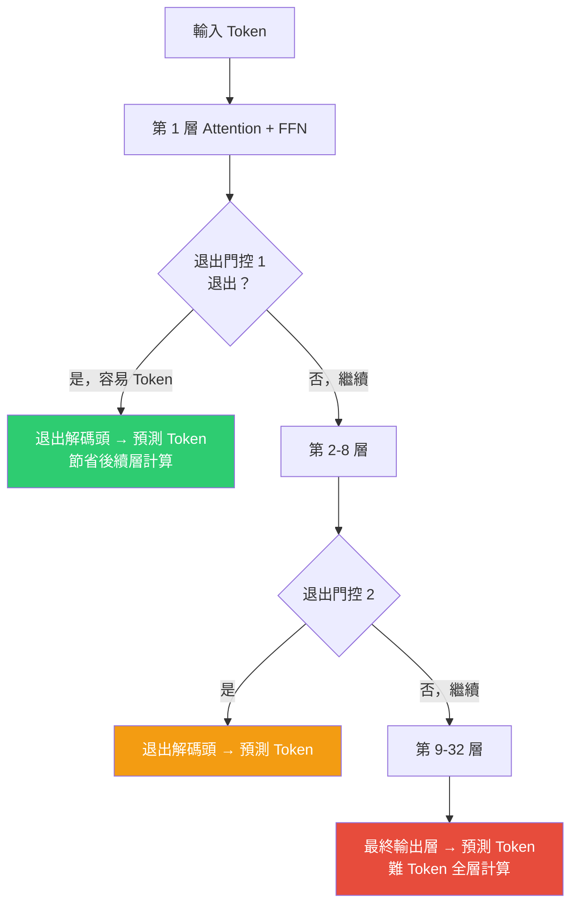

# Transformer 早期退出架構：以強化學習外化推理機制

> [!abstract] 一句話理解
> 這是一個用來「讓 Transformer 模型對簡單 token 提前完成計算、跳過不必要的深層計算」的架構改良方案，特別之處在於它用強化學習訓練模型自己學會「何時可以提前退出」，而非依賴固定規則——讓計算量依 token 難度動態分配，在不犧牲輸出品質的前提下降低推理成本。

## 🎯 為什麼重要

**它解決了什麼問題？**

**問題一：每個 token 被「同等對待」的計算浪費**

標準 Transformer 對輸出序列中的每一個 token，都執行完整的前向傳播（Forward Pass）——從第 1 層到第 N 層（通常是 32、64 甚至 128 層）。但現實中，一個句子裡的 token 難度差異極大：

- **難 token**：「量子電腦將在何時超越傳統電腦解決 NP-hard 問題？」這種需要深度推理的回答
- **易 token**：「的」、「，」、「it」、「and」等語法填充詞

對「易 token」也執行 128 層計算，是純粹的浪費。

**問題二：推理成本是 AI 商業化的主要障礙**

大型模型的推理成本（Inference Cost）是商業部署的核心挑戰：
- GPT-5.5 規模的模型每次推理消耗大量 GPU 算力
- 在高並發場景（每秒數萬次請求）下，推理成本直接影響商業可行性
- 推理成本降低 30-50%，對 AI 公司的毛利率影響可達數十億美元規模

**問題三：固定計算分配無法匹配動態任務需求**

推理模型（Reasoning Models）在生成最終答案前，先輸出大量「思考步驟」（Chain of Thought）。這些步驟的計算需求差異巨大——簡單的條件判斷 vs. 複雜的多步推導。固定深度計算無法適應這種動態需求。

**本研究的答案**：在 Transformer 架構中插入「退出門控」，用強化學習訓練模型自主學會「在哪一層退出」，達到精確性與效率的自動最優平衡。

## 🧠 入門解說（用類比理解）

**把 Transformer 的層次計算比作「問題難度分級閱卷」**

想像一個閱卷老師在改考卷：

**傳統做法（標準 Transformer）**：
無論這題是「2+2=?」還是「請推導費馬最後定理」，老師都花同樣的時間（比如 10 分鐘）仔細檢查每一道題。這對簡單題是浪費，對難題則剛好。

**早期退出做法（本論文）**：
老師從第一層閱讀開始評估：「這題這麼簡單，2 分鐘就夠了。」→ 提早交出答案。「這題很複雜，需要完整 10 分鐘才能保證品質。」→ 繼續深入分析。

**強化學習的角色**：
老師是「訓練」出來的，而不是「規定」他什麼題目花幾分鐘。強化學習給他的訓練規則是：「如果你早退出且答案對了，給你加分（效率獎勵）；如果你早退出但答案錯了，扣分（懲罰）。」老師自然學會：容易的題早退出、難題老老實實算完。

**「外化推理」的意義**：
傳統模型在推理時，思考過程完全隱藏在模型內部（黑箱）。「外化推理」（Externalised Reasoning）指讓模型以 token 形式輸出中間推理步驟，這讓每一步的計算需求更透明，退出機制的設計也更有針對性。

## 🔑 重點原理

1. **退出門控模組（Exit Gate Module）**：在 Transformer 每個（或部分）中間層後插入一個小型決策網路，接受該層的隱藏狀態（Hidden State）為輸入，輸出二元決策：「繼續向下傳播」或「在此層退出」。退出時，使用一個輕量級「退出解碼頭（Exit Head）」直接預測下一個 token，跳過後續所有層的計算。

2. **兩階段訓練（Two-stage Training）**：
   - **第一階段——校準訓練**：讓各退出層的解碼頭具備足夠的預測能力（以輔助語言模型損失函數訓練）。確保退出後的預測不是隨機猜測，而是有意義的預測。
   - **第二階段——強化學習激勵**：以任務表現（Task Performance Reward）和計算效率（Efficiency Reward）的加權組合作為獎勵訊號，訓練退出門控學會「盡可能早退出、同時維持輸出品質」。

3. **Token 層次的動態計算分配**：模型對序列中的每個位置獨立做退出決策。位置 A 的 token 可能在第 8 層退出，位置 B 的 token 可能用完所有 32 層。整個序列的計算量是各位置退出層的平均值，而非固定深度。

4. **推理模型的特殊適配**：在推理模型（Chain of Thought 模型）中，思考步驟 token 的難度差異更顯著——早期確認性步驟可能只需淺層計算，深度推導步驟需要完整深度。早期退出架構可以在不降低最終答案品質的前提下，大幅壓縮思考步驟的計算量。

5. **訓練穩定性挑戰**：RL 訓練本身容易不穩定（獎勵稀疏、梯度高方差），在 Transformer 的早期退出決策上尤為挑戰——因為退出決策的效果要到任務完成才能衡量，而任務可能在數百個 token 後才結束。這是論文承認的主要開放挑戰。

## 📊 視覺化說明

### 早期退出 Transformer 計算流程

### 早期退出 vs. 傳統固定深度 vs. 相關技術比較

| 維度 | 標準 Transformer | 早期退出（本論文）| Skip Layers (MoD) | MoE 稀疏化 |
|---|---|---|---|---|
| 每 Token 計算量 | 固定（全層）| **動態（依難度）** | 固定（跳層）| 稀疏（部分專家）|
| 難易 Token 差異化 | ✗ | ✓ | ✗ | 部分 |
| 訓練方式 | 標準監督 | **RL + 監督** | 標準監督 | 標準監督 |
| 推理時決策 | 無 | 每層動態決策 | 預定義哪些層跳過 | 路由至不同專家 |
| 目前驗證規模 | 所有規模 | **小型模型（初步）** | 中大型模型 | 大型模型 |

## 🔍 與既有技術的差異

**vs. Mixture of Experts (MoE)**

MoE 的稀疏化是在「寬度」維度——對每個 token 只激活部分專家（Experts），其他專家計算不執行。早期退出是在「深度」維度——對「容易 token」只執行前幾層，後續層計算不執行。兩者可以疊加：一個模型可以同時具備 MoE（寬度稀疏）和早期退出（深度稀疏）。

**vs. Mixture of Depths (MoD)**

MoD 讓 token 跳過部分中間層（Skip Layers）——信號從層 k 直接跳到層 k+2，跳過層 k+1 的計算。早期退出讓 token 在某層「完成計算並輸出」，之後的所有層都不執行。本質區別：MoD 是「跳過」，早期退出是「提前完成」。

**vs. Speculative Decoding（推測解碼）**

推測解碼用小模型快速生成候選 token，再用大模型驗證，加速生成但不改變大模型本身的計算結構。早期退出是在大模型內部動態調整計算深度，是模型架構層面的改變。

**vs. NEAT（Neuron-Based Early Exit）**

NEAT 在神經元粒度做退出決策（更細粒度的計算節省），本論文在層粒度做決策（粒度較粗但工程實現更簡潔）。

## 📚 關鍵詞對照表

| 中文 | 英文 | 簡短解釋 |
|---|---|---|
| 早期退出 | Early Exit | 在模型中間層提前終止計算並輸出預測的機制 |
| 動態計算分配 | Dynamic Compute Allocation | 依輸入難度動態調整計算量的策略 |
| 退出門控 | Exit Gate | 決定是否在當前層退出的小型決策模組 |
| 前向傳播 | Forward Pass | 資料從輸入層通過所有網路層到輸出的計算過程 |
| 退出解碼頭 | Exit Head | 附加在中間層、用於在退出時預測 token 的輕量解碼器 |
| 外化推理 | Externalised Reasoning | 讓模型以可見 token 形式輸出推理步驟（非隱藏內部計算）|
| 強化學習獎勵 | RL Reward | 訓練代理行為的訊號，正值鼓勵、負值懲罰 |
| 推理成本 | Inference Cost | 模型執行一次前向傳播所消耗的計算資源成本 |

## 🛠️ 可能的應用場景

1. **邊緣設備 LLM 部署**：在手機、IoT 設備等算力受限環境中，早期退出讓大型模型能以有限算力完成大部分「容易」的推理任務，複雜任務才使用完整計算。

2. **高並發 API 推理服務**：在每秒服務數萬次請求的 API 場景中，若 50% 的 token 能在前 1/3 的層就退出，整體吞吐量可以大幅提升，成本對應下降。

3. **推理模型的思考步驟壓縮**：對 o3、Claude Opus 4.8 等推理模型，Chain of Thought 中的簡單步驟（如確認、重複、過渡）可以早期退出，只有真正需要深度推理的步驟才用完整計算。

4. **即時互動應用**：在需要低延遲的對話應用（語音助理、即時翻譯）中，降低平均計算深度可以減少首 token 延遲（Time to First Token, TTFT）。

5. **批量文本處理**：在文檔摘要、分類、提取等批量任務中，大量「定型」的輸出 token（日期、名稱、常見詞彙）可以早期退出，提升批處理效率。

## 📖 學習路徑建議

1. **先讀**：Transformer 基礎架構（Attention Is All You Need, Vaswani et al., 2017）——理解「層」和「前向傳播」的基本概念，這是早期退出的基礎語境。
2. **再讀**：Mixture of Experts (MoE) 基礎——理解「稀疏激活」和「動態計算分配」的基本思路，MoE 是理解早期退出的好前置知識。
3. **再讀**：本篇對應新聞筆記——了解 arXiv 2603.21376 論文的完整背景。
4. **進階**：NEAT: Neuron-Based Early Exit (arXiv 2602.02010) 和 Dynamic Early Exit in Reasoning Models (arXiv 2504.15895)——理解同方向的相關研究。
5. **進階**：強化學習（RL）基礎——理解獎勵訊號、策略梯度等 RL 核心概念，因為本論文的第二訓練階段完全依賴 RL。

## 🔗 延伸閱讀
- 原文連結：[arXiv 2603.21376](https://arxiv.org/abs/2603.21376)
- 對應新聞筆記：[[2026-06-05-Transformer早期退出架構以強化學習激勵外化推理]]
- 相關研究：[NEAT Neuron-Based Early Exit](https://arxiv.org/pdf/2602.02010)
- 相關研究：[Dynamic Early Exit in Reasoning Models](https://arxiv.org/html/2504.15895v1)

---
*由 Claude 自動整理於 2026-06-05*
