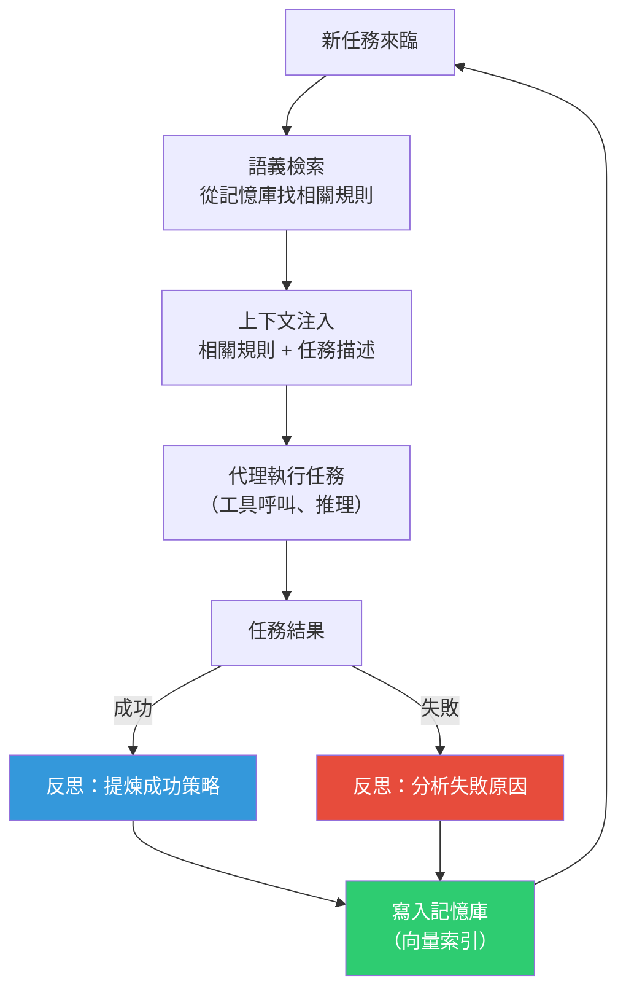

# ERL：讓 AI 代理像人一樣從經驗中學習

> [!abstract] 一句話理解
> 這是一個用來「讓 LLM 代理從自身任務執行的成功與失敗中自動提煉可跨任務重用的學習心得（啟發式規則）」的框架，特別之處在於它完全不需要重新訓練模型——代理在「反思後寫筆記、下次用前看筆記」這個循環中持續進步，就像人類在工作中積累的 SOP（標準作業程序）。

## 🎯 為什麼重要

**它解決了什麼問題？**

**問題一：LLM 代理有「金魚記憶」**

以 Claude、GPT 等為基礎的 AI 代理，其核心語言模型的參數在部署後是固定的。無論代理在任務中犯了多少次同類錯誤，下一次對話開始時，模型仍然「不記得」之前發生了什麼——它沒有從失敗中「學習」的能力，只有基礎模型預訓練時習得的通用能力。

這就像一個員工，每天早上報到時都失憶了，需要主管重新告訴他所有公司的運作流程和潛規則。

**問題二：重新訓練模型成本極高**

要讓模型真正「記住」某種行為模式，需要在訓練資料中包含相關範例，或透過 RLHF（人類回饋強化學習）等方法調整模型參數。這個過程：
- 需要大量計算資源（數十到數百萬美元的計算費用）
- 需要大量高品質標注資料
- 週期長（數天到數週）
- 每次環境改變就需要重做

對部署後的生產系統做持續再訓練是不切實際的。

**問題三：現有「外部記憶」方案缺乏主動學習能力**

RAG（檢索增強生成）可以讓代理存取外部知識庫，但那些知識是人工準備的，代理不會自己更新它。ERL 的核心創新是：**讓代理自己產生外部記憶的內容**，把從任務中學到的經驗轉化為可檢索的知識。

## 🧠 入門解說（用類比理解）

**把 ERL 代理比作「寫工作日誌的顧問」**

想像一位企業顧問負責幫客戶解決各種管理問題：

**沒有 ERL 的代理（只有基礎訓練）**：
每個新客戶都像第一個客戶。即使他昨天剛幫一家零售企業解決了「AI 導入阻力」的問題，今天面對另一家零售企業時，他還是從零開始分析，不記得昨天哪些方法有效、哪些沒用。

**有 ERL 的代理（帶工作日誌）**：
每次結束一個項目，他會花 15 分鐘寫下：
> 「對零售業，先從 POS 系統整合切入往往比從物流切入更容易得到業務部門的支持，因為 POS 數據是他們每天關心的。」

下次遇到零售客戶，他先翻工作日誌，找到這條筆記，然後把這個「教訓」作為分析框架的一部分。

**跨行業遷移（ERL 的特色）**：
更厲害的是，他在零售業學到的「從業務最關心的數據點切入」的原則，在服務製造業客戶時也適用——只是數據點從 POS 換成了生產良率。啟發式規則是可遷移的。

## 🔑 重點原理

1. **「反思」是核心動作（Reflection）**：每次任務完成後，ERL 觸發反思程序——LLM 以「自我分析」模式回顧整個任務的執行軌跡（每一步行動、工具呼叫、觀察結果）。這不是被動的記錄，而是主動的推理：「為什麼步驟 A 有效？」、「為什麼策略 B 失敗了？」、「下次遇到類似情境，應該怎麼做？」

2. **啟發式規則的格式設計**：ERL 提煉出的「學習心得」被組織為結構化的自然語言規則，通常包含：
   - **When（情境觸發）**：在什麼情況下這條規則適用？
   - **Do（建議行動）**：具體應該採取什麼策略？
   - **Avoid（禁止事項）**：哪些常見錯誤需要避開？
   格式化的規則比自由散文更容易被後續任務的語義搜尋命中。

3. **語義向量索引（Semantic Vector Index）**：所有啟發式規則以語義嵌入（Semantic Embedding）的形式存入向量資料庫。這讓代理能根據當前任務的語義相似性，精準找出最相關的過去「心得」——不只是關鍵字匹配，而是概念層面的相似度搜尋。

4. **測試時的「看筆記」步驟（Retrieval Augmentation）**：面對新任務時，ERL 框架先從記憶庫中檢索 Top-K 相關啟發式規則，將其插入代理的思考提示詞前段（System Prompt 或任務描述之前），讓代理在「看了今天相關建議」後再開始執行任務。

5. **跨任務遷移的自然湧現（Cross-task Transfer）**：由於啟發式規則是以自然語言描述的「原則」而非特定步驟，高品質的規則天然具有泛化性。「分解複雜任務為獨立子任務後再逐一解決」這類原則，在程式碼生成、網頁搜尋、文件撰寫等各類任務中都適用。

## 📊 視覺化說明

### ERL 的完整學習-部署循環

### ERL vs 其他代理記憶增強方案比較

| 方案 | 知識來源 | 更新方式 | 是否需要再訓練 | 可解釋性 |
|---|---|---|---|---|
| **ERL（本論文）** | 代理自身任務經驗 | 自動（反思後生成）| ✗ 不需要 | ✓ 高（自然語言規則）|
| RAG（標準）| 人工準備的文件庫 | 人工更新 | ✗ | ✓ 高 |
| Fine-tuning | 人工標注訓練集 | 手動（週期性）| ✓ 需要 | ✗ 低（黑箱參數）|
| In-context Learning | 人工準備示例 | 手動 | ✗ | ✓ 高 |
| MemGPT / 外部記憶 | 對話記錄 | 自動（摘要壓縮）| ✗ | 中（摘要形式）|

## 🔍 與既有技術的差異

**vs. Reflexion（反思框架）**

Reflexion 是一個相關的早期工作，讓代理在失敗後自我批評並調整策略。兩者都有「反思」步驟，但 ERL 的關鍵突破是：
- Reflexion 的反思主要是「這次任務的局部修正」
- ERL 的反思是「提煉可跨任務遷移的通用規則」，記憶比 Reflexion 更持久和可重用

**vs. MemGPT**

MemGPT 設計了一套「記憶管理層」，讓模型能在上下文視窗超限時自動壓縮和調取對話歷史。ERL 的記憶不是對話歷史，而是從歷史中**主動提煉的抽象規則**，層次更高，遷移性更好。

**vs. Toolformer / Tool-augmented Agents**

工具增強代理讓 LLM 學會使用外部工具（搜尋、計算機）。ERL 不是關於工具的學習，而是關於「如何更好地在任何環境中完成任務」的策略性知識積累。兩者可以疊加。

## 📚 關鍵詞對照表

| 中文 | 英文 | 簡短解釋 |
|---|---|---|
| 啟發式規則 | Heuristic | 從經驗提煉的經驗法則，不保證最優但通常有效 |
| 任務軌跡 | Task Trajectory | 代理執行任務的完整過程記錄（行動序列+觀察結果）|
| 語義嵌入 | Semantic Embedding | 將文字轉換為數值向量，使語義相近的文字在向量空間中距離接近 |
| 向量資料庫 | Vector Database | 專門存儲和搜尋高維度語義向量的資料庫（如 Pinecone、Chroma）|
| 檢索增強生成 | RAG (Retrieval-Augmented Generation) | 從外部資料庫檢索相關內容注入 LLM 上下文的技術 |
| 跨任務遷移 | Cross-task Transfer | 在一種任務上學到的知識能應用到不同類型任務的能力 |
| 反思 | Reflection | 代理對自身過去行為進行分析和學習的過程 |
| 上下文注入 | Context Injection | 將額外資訊（如啟發式規則）插入模型推理的提示詞中 |

## 🛠️ 可能的應用場景

1. **企業長期運行的 AI 代理**：客服代理、流程自動化代理在長期運行中積累組織特有的最佳實踐，如「這個客戶類型最適合直接給解決方案而非問題確認」。

2. **軟體開發代理（Coding Agent）**：GitHub Copilot Workspace 或 Claude Code 類的程式碼生成代理，從過去的程式碼審查反饋中學習組織的程式碼風格偏好和常見錯誤避免策略。

3. **科學研究代理**：在多輪實驗規劃中，代理從過去的實驗失敗（假設被否定）中提煉研究策略，避免在後續實驗中重複同類錯誤。

4. **個人 AI 助理**：個人助理從使用者的歷史互動中學習其偏好（如「這個用戶喜歡簡潔回答，不喜歡過多解釋」），提供越來越個性化的服務。

5. **多代理協作系統**：在 Multi-Agent 系統中��各個子代理的啟發式規則可以透過共享記憶庫互通，實現「集體智慧」——一個代理的學習成果讓整個系統受益。

## 📖 學習路徑建議

1. **先讀**：LLM Agent 基礎——ReAct（Reason + Act）框架，理解現代 LLM 代理的基本架構和工具使用模式
2. **再讀**：RAG（檢索增強生成）基礎——理解向量資料庫和語義搜尋的工作原理，這是 ERL 記憶檢索機制的底層技術
3. **再讀**：本篇對應新聞筆記——了解 arXiv 2603.24639 的完整背景
4. **進階**：Reflexion（Shinn et al., 2023）——理解 ERL 的先驅研究，對比兩者設計的異同
5. **進階**：Agent Skills for LLMs (arXiv 2602.12430)——更廣泛的代理能力框架，涵蓋技能習得和安全問題

## 🔗 延伸閱讀
- 原文連結：[arXiv 2603.24639](https://arxiv.org/abs/2603.24639)
- 對應新聞筆記：[[2026-06-06-ERL自我改進LLM代理框架經驗反思學習]]
- 相關論文：[Agent Skills for LLMs: Architecture, Acquisition, Security](https://arxiv.org/abs/2602.12430)
- 相關技術：[Externalization in LLM Agents: Memory, Skills, Protocols](https://arxiv.org/pdf/2604.08224)

---
*由 Claude 自動整理於 2026-06-06*
