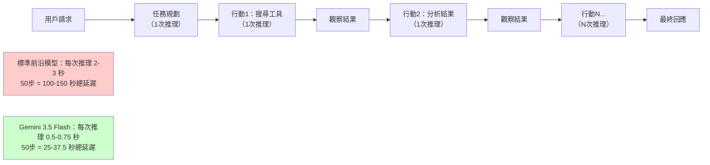

# Gemini 3.5 Flash：為什麼「快速前沿模型」正在改變 AI 代理的遊戲規則

> [!abstract] 一句話理解
> 這是一個用來「以四倍速度提供前沿級別智能，特別為 AI 代理工作流和多步驟代碼任務優化」的多模態大型語言模型，特別之處在於它打破了「前沿智能必然伴隨低速高價」的假設——以 $1.50/M tokens 的競爭性定價，讓高度自動化的 AI 代理系統在商業規模上變得更可行。

## 🎯 為什麼重要

**它解決了什麼問題？**

**問題一：AI 代理的速度瓶頸**

傳統前沿模型（如 GPT-4、Claude Opus）在單步推理上品質優秀，但在代理場景中，一個任務往往需要 20-100 步甚至更多的「思考-行動-觀察」循環（ReAct 框架）。每步多一秒的延遲，在 50 步的任務中就是 50 秒——對需要低延遲響應的即時代理應用（語音助理、即時翻譯、互動式分析）是難以接受的。

**問題二：AI 代理的成本瓶頸**

一個複雜的代理任務可能消耗 10,000-100,000 個 tokens（包含工具呼叫的輸入/輸出）。以較高定價的前沿模型執行這樣的任務，成本可能達到 $1-10 美元**每次任務**。對需要服務百萬用戶的企業應用，每次任務節省幾美分意味著每年節省數百萬美元。

**問題三：長上下文分析的可及性**

在 Gemini 3.5 Flash 之前，100 萬 token 上下文的前沿模型或者速度緩慢，或者定價高昂。現在 $1.50/M tokens 的定價，讓「一次性放入整個程式碼庫（幾十萬行程式碼）」或「一次性分析幾年的財務報告」在商業規模上可行。

## 🧠 入門解說（用類比理解）

**把 AI 模型的「速度-智能-成本」三角比作快遞服務**

假設你要寄快遞，有三種選擇：

1. **標準快遞（傳統 LLM API）**：可靠，但2-3天到達，費用適中
2. **順豐隔天達（早期前沿模型）**：快速且可靠，但很貴
3. **速遞新服務（Gemini 3.5 Flash）**：同日達，費用與隔天達相當，速度卻快四倍

Gemini 3.5 Flash 重新定義了「快速」和「便宜」可以共存的邊界。但真正有趣的不只是它快，而是**它讓「每小時發送 1000 個包裹」的工作流變得可行**——對應的是 AI 代理每小時執行數千次推理循環的場景。

**動態思維（Dynamic Thinking）的類比**

想像一個顧問在處理問題時，有兩個模式：
- **快速模式**：遇到常規問題，馬上給答案（「這是什麼版本的 Python？」→「直接告訴他 3.12」）
- **深度思考模式**：遇到複雜問題，先花時間在腦中推演幾個方案（「如何優化這個演算法的時間複雜度？」→「讓我先想想幾種可能的路徑...」）

Gemini 3.5 Flash 的「動態思維預設啟用」意味著它能自動判斷什麼時候用快速模式、什麼時候深入思考，而不是對所有問題都用同等力度——這同時優化了速度和準確性。

## 🔑 重點原理

1. **前沿模型定義（Frontier Model）**：指在一或多個關鍵能力維度達到當時業界最高水準的 AI 模型。Gemini 3.5 Flash 的「前沿智能」定義是在代理任務（Agentic Tasks）和程式碼生成基準上優於前代 Gemini 3.1 Pro——這不是所有任務的頂尖，而是目標場景的頂尖。

2. **動態思維（Dynamic Thinking）**：模型在回應時能自主選擇「直接輸出」或「先進行 Chain-of-Thought 推理後再輸出」。對簡單問題直接輸出節省 tokens 和時間；對複雜問題先思考提升準確性。這種動態切換在 Gemini 3.5 Flash 是預設行為，而非需要手動啟用的選項。

3. **MCP（Model Context Protocol）整合**：MCP Atlas 基準測試（83.6%）衡量模型與 MCP 生態系統整合的能力。MCP 是一個標準化協議，讓 AI 模型能以一致的方式呼叫各種外部工具和數據源（類似 USB 接口的統一標準）。高 MCP 分數意味著 Gemini 3.5 Flash 能有效在企業現有 SaaS 工具生態中作為「大腦」工作。

4. **Terminal-Bench 代理任務**：評估模型在「終端機操作代理任務」的表現——包含多步驟命令執行、錯誤排除、環境配置等真實的 DevOps 和系統管理場景。76.2% 的成績代表在這類需要連續操作和即時反應的任務上具有高度可靠性。

5. **快取定價機制（Cached Input Pricing）**：對於重複出現在多次請求中的相同內容（如系統提示詞、長文件、程式碼庫），Gemini API 提供 90% 折扣的快取價格（$0.15/M vs $1.50/M）。這對於系統提示詞較長、文件類型應用（RAG）、批量文件處理等場景，可以將實際成本降低數倍。

## 📊 視覺化說明

### AI 代理的推理循環與 Gemini 3.5 Flash 的速度優勢

### Gemini 3.5 Flash 關鍵規格與競爭對比

| 規格 | Gemini 3.5 Flash | 說明 |
|---|---|---|
| 相對速度 | **4× 基準速度** | 對比同類前沿模型 |
| 上下文視窗 | **1,000,000 tokens** | 可處理整部百科全書 |
| 輸入模態 | 文字、圖片、音訊、影片 | 真正的多模態 |
| Terminal-Bench 2.1 | **76.2%** | 代理操作任務 |
| MCP Atlas | **83.6%** | 工具整合能力 |
| CharXiv Reasoning | **84.2%** | 多模態圖表推理 |
| 輸入定價 | **$1.50/M tokens** | 全球區域 |
| 快取輸入定價 | **$0.15/M tokens** | 90% 折扣 |
| 動態思維 | **預設啟用** | 自動選擇推理深度 |

## 🔍 與既有技術的差異

**vs. Gemini 3.1 Pro（前代旗艦）**

Gemini 3.5 Flash 在代理任務和程式碼基準上超越 3.1 Pro，但以低得多的推理延遲和有競爭力的定價實現。這並不代表 3.5 Flash 在所有任務上都優於 3.1 Pro（如高難度文學寫作、複雜數學推理），而是在「批量、代理、工具」場景的性能-成本比遠優。

**vs. Claude Opus 4.8（Anthropic）**

Claude Opus 4.8 定位為最高能力的推理模型，擅長複雜邏輯和安全性要求高的場景（如法律、醫療）。Gemini 3.5 Flash 的優勢在速度和多模態（特別是音訊/影片），Opus 4.8 的優勢在深度推理和對齊。企業通常會根據任務性質選擇不同模型。

**vs. GPT-4o（OpenAI）**

GPT-4o 同樣是強力的多模態模型，但在代理任務基準和 MCP 整合優化上，Gemini 3.5 Flash 有針對性的競爭優勢，特別是 Terminal-Bench 類的系統操作任務。

**vs. 較小的高速模型（如 Claude Haiku 4.5）**

小型模型速度更快但能力有限；Gemini 3.5 Flash 的獨特定位是「以接近小模型的速度和成本，提供前沿模型的能力」，這個定位填補了過去「好、快、便宜三選二」的空缺。

## 📚 關鍵詞對照表

| 中文 | 英文 | 簡短解釋 |
|---|---|---|
| 前沿模型 | Frontier Model | 在特定能力維度達到業界最高水準的 AI 模型 |
| 動態思維 | Dynamic Thinking | 模型自動選擇是否進行鏈式推理再輸出的能力 |
| 模型上下文協議 | MCP (Model Context Protocol) | 標準化 AI 模型呼叫外部工具的協議，類似 AI 版的 USB |
| 推理延遲 | Inference Latency | 從發送請求到收到回應的時間，首 token 延遲（TTFT）是關鍵指標 |
| 快取折扣 | Cached Input Discount | 對重複出現的相同輸入內容提供折扣的定價機制 |
| 多模態 | Multimodal | 模型能處理多種類型輸入（文字、圖片、音訊、影片）的能力 |
| 代理任務 | Agentic Task | 需要 AI 自主規劃並執行多步驟行動才能完成的任務 |
| 吞吐量 | Throughput | 單位時間內可處理的請求或 tokens 數量 |

## 🛠️ 可能的應用場景

1. **大規模文件分析流水線**：將整份年報、法律合約、醫療病歷（100 萬 token 以內）一次性送入模型，以快取折扣大幅降低成本，同時利用高速獲得快速的批量處理結果。

2. **即時客服代理**：在需要低延遲的實時對話代理中，四倍速度使用戶等待時間縮短，直接提升用戶體驗，特別是在語音交互場景中。

3. **自動化 DevOps 代理**：Terminal-Bench 76.2% 的表現意味著 Gemini 3.5 Flash 可以可靠地執行複雜的伺服器管理、部署腳本、問題診斷等任務，適合 CI/CD 流水線中的 AI 代理集成。

4. **影片/音訊內容分析**：多模態能力使其能直接分析會議錄影、客服通話錄音等，提取關鍵資訊，無需先進行語音轉文字的前處理步驟。

5. **企業 MCP 生態整合**：高 MCP Atlas 分數意味著企業可以將 Gemini 3.5 Flash 作為「大腦」，整合現有的 Slack、Salesforce、Jira、GitHub 等 SaaS 工具，構建全自動的工作流代理。

## 📖 學習路徑建議

1. **先讀**：AI 代理基礎——ReAct（Reasoning + Acting）框架，理解「思考-行動-觀察」循環的基本工作方式
2. **再讀**：LLM 評測指標——了解 Benchmark 的設計原理和局限性，避免過度依賴單一分數
3. **再讀**：本篇對應新聞筆記——Gemini 3.5 Flash 的完整規格和上下文
4. **進階**：MCP（Model Context Protocol）規範——理解 AI 工具整合標準化的技術細節
5. **進階**：Gemini 3.5 Pro（預計 2026 年 6 月發布）——了解 Flash 和 Pro 的定位差異，形成完整的 Gemini 3.5 系列認知

## 🔗 延伸閱讀
- 原文連結：[Google Blog - Gemini 3.5](https://blog.google/innovation-and-ai/models-and-research/gemini-models/gemini-3-5/)
- 對應新聞筆記：[[2026-06-06-Google Gemini 3.5 Flash前沿智能四倍速AI代理模型]]
- 定價詳情：[Gemini API 定價頁](https://ai.google.dev/gemini-api/docs/pricing)
- 競爭情報：[LLM Stats 比較](https://llm-stats.com/blog/research/gemini-3.5-flash-launch)

---
*由 Claude 自動整理於 2026-06-06*
