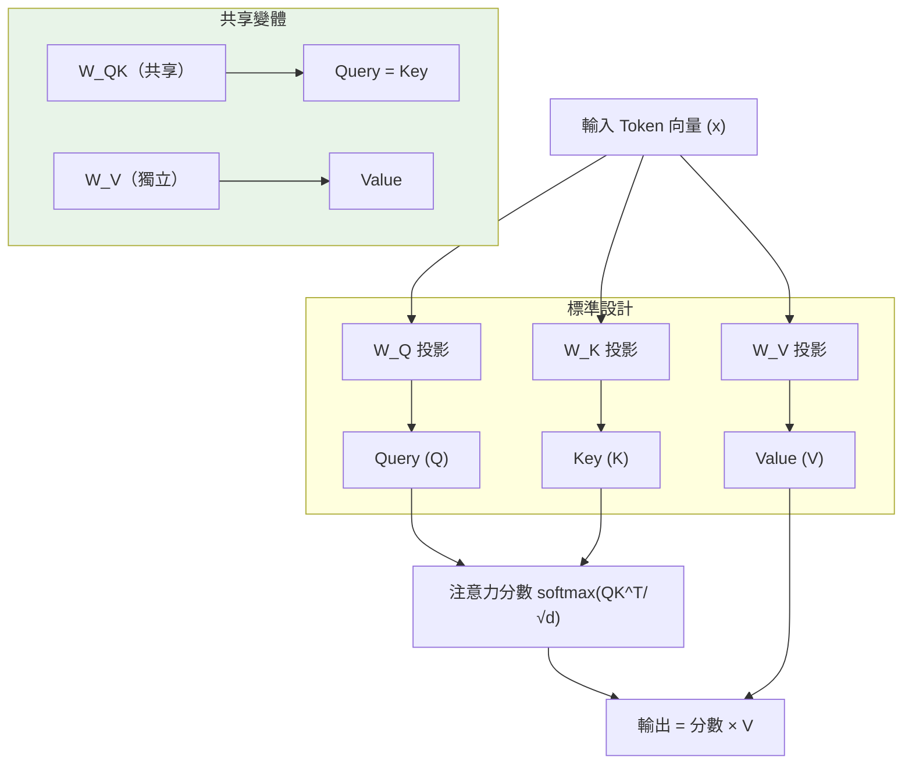

# Transformer 是否真的需要 Q、K、V 三個投影矩陣？

> [!abstract] 一句話理解
> 這是一個用來「系統驗證 Transformer 注意力機制中三個投影矩陣（Q、K、V）是否都不可或缺」的研究，特別之處在於它透過 ICML 2026 嚴格的實驗體系發現：在多種任務和兩個語言模型規模上，**共享或合併部分投影的變體效果與標準設計相當甚至略優**，暗示業界長期沿用的三投影設計可能存在被優化的空間。

## 🎯 為什麼重要

**它解決了什麼問題？**

**問題一：Transformer 的 QKV 設計長期被視為「不可觸碰的聖牛」**

自 2017 年「Attention Is All You Need」論文發表以來，Transformer 的 Q（Query）、K（Key）、V（Value）三投影設計幾乎被所有後續模型沿用——GPT、BERT、LLaMA、Gemini、Claude 都是。然而，**為什麼需要三個而不是兩個甚至一個投影矩陣**，缺乏系統性的實證研究，大多是「設計上合理，就繼續用」的慣性。

**問題二：模型參數效率的追求**

現代大型語言模型（LLM）的參數量動輒數十億至數百億。如果三個 QKV 投影中有一個甚至兩個是「可以省略或共享的」，那麼：
- 模型參數量可縮減約 20-33%
- 對應的訓練計算量降低
- 推理時的模型載入記憶體需求減少

這對邊緣設備部署（手機、車載）的意義尤為重要。

**問題三：未來架構創新的基礎**

如果研究證明某些投影共享不損失效能，就為後續的「更激進架構壓縮」研究提供了科學依據，而不只是工程上的試錯。

## 🧠 入門解說（用類比理解）

**把注意力機制比作「圖書館的三個工作人員」**

想像你在一個圖書館，問館員「關於量子電腦的書在哪？」

- **Query（Q）工作人員**：接收你的問題（你的需求表述），把問題轉化成「可以搜尋的格式」
- **Key（K）工作人員**：負責給每本書貼標籤（「這本書的索引關鍵字是什麼？」），讓 Q 能找到匹配的書
- **Value（V）工作人員**：管理實際的書架，當 Q 和 K 匹配成功後，取出「實際的內容」給你

**標準設計（三個獨立工作人員）**：
Q、K、V 各有一套完全獨立的「轉換方式」（投影矩陣），互不干擾，靈活性最高但成本最高。

**共享設計（例如 K=V）**：
「標籤工作人員」和「取書工作人員」是同一個人，用同一套理解來做兩件事。效率更高，但功能上有所限制。

**這個論文的發現**：在很多任務中，「一個人做兩件事」（K=V 共享）的效果跟「兩個人各做一件事」幾乎一樣好——這說明圖書館其實不需要那麼多專職工作人員。

## 🔑 重點原理

1. **標準 QKV 注意力機制**：對每個輸入 token，分別透過三個獨立的線性變換矩陣（$W_Q$、$W_K$、$W_V$）投影到 Query、Key、Value 空間；注意力分數 = softmax(QK^T / √d_k)，輸出 = 注意力分數 × V。每個投影矩陣是一組可學習參數，貢獻約 1/3 的注意力層參數量。

2. **三種共享變體**：
   - **Q-K=V**：Query 獨立，Key 與 Value 共用同一投影矩陣，節省一組參數。基礎假設：K 和 V 都是「描述輸入 token 本身特性」的表示，功能上有重疊。
   - **Q=K-V**：Query 與 Key 共用投影，Value 獨立。基礎假設：Q 和 K 都是用來計算注意力分數（Relevance）的，可以在同一空間。
   - **Q=K=V（單一投影）**：最激進，所有三者共用一個投影矩陣，退化為「自相似注意力」。

3. **2D 位置編碼的非對稱性修正**：標準注意力計算 $QK^T$ 是對稱的（token A 對 B 的注意力 = B 對 A 的注意力），但自然語言中的方向性（「我喜歡你」vs「你喜歡我」）需要非對稱性。引入 2D 位置編碼（2D Positional Encodings）可在共享投影的框架下恢復非對稱性。

4. **實驗覆蓋範圍**：論文橫跨合成任務、視覺任務（MNIST/CIFAR/TinyImageNet/異常偵測）、語言建模（300M 和 1.2B 參數模型，各訓練 10B tokens），確保結論不只是特定任務的偶然表現。

5. **ICML 2026 錄用意義**：這個級別的國際頂會錄用代表論文通過了嚴格的同儕審查，方法論可信度高，但也不代表在更大規模模型（70B+）上的結論可以直接推廣。

## 📊 視覺化說明

### QKV 三種共享變體的計算流程

### 各投影變體對比

| 變體 | Q 投影 | K 投影 | V 投影 | 參數節省 | 效果 |
|---|---|---|---|---|---|
| 標準 QKV | 獨立 $W_Q$ | 獨立 $W_K$ | 獨立 $W_V$ | 0% | 基準 |
| Q-K=V | 獨立 | 共享 $W_{KV}$ | 共享 $W_{KV}$ | ~33% | 相當或略優 |
| Q=K-V | 共享 $W_{QK}$ | 共享 $W_{QK}$ | 獨立 | ~33% | 相當或略優 |
| Q=K=V | 單一 $W$ | 單一 $W$ | 單一 $W$ | ~67% | 相當或略優 |

## 🔍 與既有技術的差異

**vs. Multi-Query Attention（MQA）**
MQA 是另一種減少注意力計算量的方法——讓多個 Query Head 共享同一組 K/V。MQA 側重於降低 KV Cache 的記憶體佔用（對推理加速有直接意義），而本論文的投影共享側重於減少投影矩陣的參數量（對模型大小有直接影響）。兩者可以疊加。

**vs. Grouped Query Attention（GQA）**
GQA 是 MQA 的改進版（LLaMA 2/3 採用），讓每幾個 Query Head 共享一組 K/V Head。GQA 是 Head 層面的共享；本論文是投影矩陣層面的共享，粒度不同。

**vs. Linear Attention**
線性注意力（Linear Attention）透過改變注意力計算方式（去掉 softmax）來降低計算複雜度，但通常帶來性能損失。本論文的投影共享不改變計算方式，對性能影響更小。

**vs. LoRA / 低秩適應**
LoRA 是在已訓練好的投影矩陣上添加低秩增量，用於微調。本論文的共享是在訓練過程中的架構設計，兩者問題不同，但同樣關注注意力投影的參數效率。

## 📚 關鍵詞對照表

| 中文 | 英文 | 簡短解釋 |
|---|---|---|
| 注意力機制 | Attention Mechanism | Transformer 的核心計算單元，讓模型學習序列中不同位置的關係 |
| 投影矩陣 | Projection Matrix | 將輸入向量轉換到另一個向量空間的線性變換矩陣（可學習參數）|
| 查詢/鍵/值 | Query / Key / Value | 注意力機制的三種角色：提問者、索引標籤、實際內容 |
| 注意力分數 | Attention Score | Query 與 Key 點積後 softmax 的輸出，表示各 token 對當前 token 的重要程度 |
| 點積注意力 | Dot-product Attention | 以 Q·K^T 計算相似度的標準注意力公式 |
| KV 快取 | KV Cache | 推理時緩存 K、V 向量以避免重複計算，是長上下文推理效率的關鍵 |
| 多頭注意力 | Multi-Head Attention | 並行運行多組 QKV 注意力，每組學習不同的語言關係模式 |
| 困惑度 | Perplexity | 語言模型評估指標，數值越低代表對測試文本的預測越準確 |

## 🛠️ 可能的應用場景

1. **邊緣設備 LLM 部署**：手機、車載、IoT 設備的算力限制嚴苛，採用 Q=K=V 單一投影可減少 ~67% 的注意力層參數，在不改變模型整體架構的前提下顯著縮小模型大小。

2. **低資源語言模型訓練**：在計算資源有限的研究機構（如學術院所）訓練新模型時，共享 QKV 投影可降低訓練成本。

3. **特定領域的垂直模型**：針對程式碼、醫療記錄、法律文件等特定域訓練的較小模型，在特定任務上共享 QKV 或許帶來更好的泛化，而非更大的標準模型。

4. **架構搜尋（NAS）研究**：本論文的發現為神經架構搜尋提供了新的搜尋維度——可以將 QKV 共享方式作為可搜尋的架構超參數。

5. **量子化與模型壓縮的前處理**：在對模型進行量子化（Quantization）之前，先採用 QKV 共享可以在不損失精度的前提下進一步縮小模型體積。

## 📖 學習路徑建議

1. **先讀**：Vaswani et al. (2017) "Attention Is All You Need"——理解標準 QKV 注意力機制的原始設計動機與數學形式
2. **再讀**：Multi-Query Attention (MQA) 和 Grouped Query Attention (GQA) 的相關文章——建立「注意力機制效率優化」的知識框架
3. **再讀**：本篇對應新聞筆記——了解 arXiv 2606.04032 論文的完整背景
4. **進階**：QV May Be Enough (arXiv 2603.15665)——同方向的相關研究，探討去掉 K 投影的可行性
5. **進階**：Linear Attention 相關文獻——更激進的注意力機制改進方向的比較視角

## 🔗 延伸閱讀
- 原文連結：[arXiv 2606.04032](https://arxiv.org/abs/2606.04032)
- 對應新聞筆記：[[2026-06-06-Transformer是否需要三個投影矩陣QKV變體系統研究ICML2026]]
- 相關論文：[QV May Be Enough](https://arxiv.org/html/2603.15665)
- 經典基礎：[Attention Is All You Need (2017)](https://arxiv.org/abs/1706.03762)

---
*由 Claude 自動整理於 2026-06-06*
