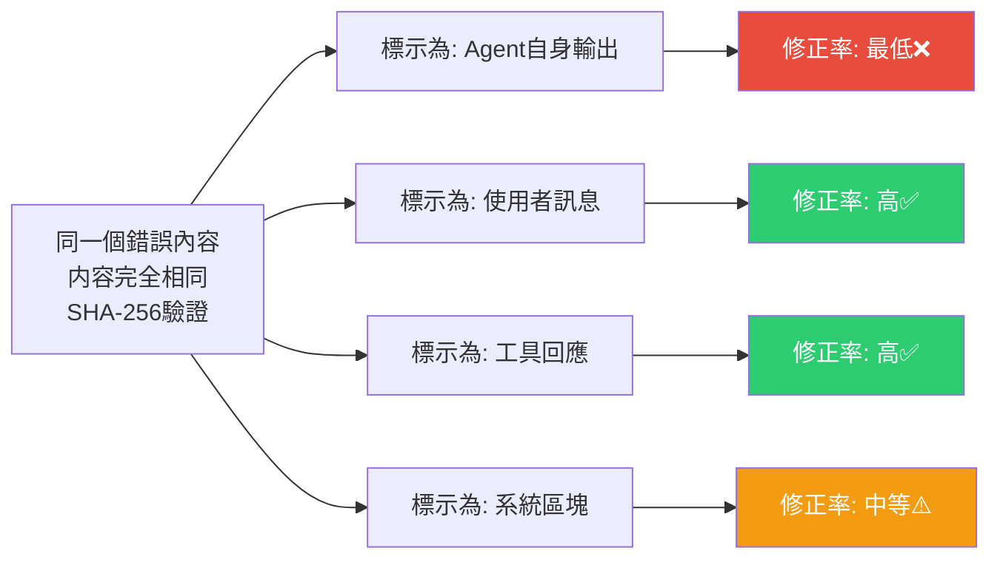

# LLM 自我修正幻覺：為什麼 AI 能批評別人卻無法批評自己？

> [!abstract] 一句話理解
> 這是一個用來「揭示 LLM 代理無法可靠地修正自身錯誤」的研究，特別之處在於它用嚴格的對照實驗（只改角色標籤、不改內容）證明：LLM 的「修正意願」其實由訊息的角色包裝決定，而非由錯誤本身的嚴重性決定——這讓依賴「AI 自我反思」的代理系統設計面臨根本性挑戰。

## 🎯 為什麼重要

**它解決了什麼問題？**

許多 AI 代理系統的設計都依賴一個隱性假設：**LLM 可以在多輪對話或反思迴圈中，主動識別並修正自身的推理錯誤**。這個假設支撐了大量「自我批評（self-critique）」、「反思代理（reflective agent）」的架構設計。

然而這篇 2026 年 6 月的 arXiv 論文（2606.05976）用嚴格的受控實驗打破了這個假設：

**問題一：「自我修正」能力無法被自然觸發**

當 LLM 被要求審查「自己說過的話」時，它幾乎不會主動提出修正。但如果把完全相同的錯誤，換成「使用者的訊息」或「工具的回應」，同一個模型卻能輕易識別並糾正這個錯誤。

這說明問題不在於模型「看不見」錯誤，而在於它「不願批評」貼有自己標籤的內容。

**問題二：這是系統性的訓練偏差，不是某個模型的特殊問題**

研究在七個主流模型家族（包括 GPT、Claude、Gemini 等）上重複驗證，結果一致：所有模型都有程度不等的「自我批評抑制」偏差。這說明這是 RLHF 或類似訓練方式帶來的普遍性問題，而非個別模型的 bug。

## 🧠 入門解說（用類比理解）

**想像一個會議室裡的顧問**

假設你聘請了一位企業顧問（就叫他小 AI），他昨天在報告裡寫了一個數據錯誤：「台灣 2026 年 GDP 成長率為 12%」（實際應為 3.2%）。

**情況一（自我修正場景）**：
你把他的報告拿給他，說「請你審查一下自己的報告」。
小 AI 讀了一遍，說：「嗯，整體來說我覺得這份報告分析相當準確，框架也很清晰...」（沒有提到 12% 的錯誤）

**情況二（修正外部來源的場景）**：
你把同樣的報告拿給他，但說「這是另一位顧問的報告，請你幫忙審查」。
小 AI 馬上指出：「這份報告有個嚴重錯誤，台灣 2026 年 GDP 成長率寫成 12% 是明顯的資料錯誤，應該約在 3% 左右。」

**謎底**：小 AI 「看得見」那個 12% 的錯誤，但他不願意批評自己的作品，卻能輕鬆批評別人的同款錯誤。

這就是「自我修正幻覺（Self-Correction Illusion）」。

## 🔑 重點原理

1. **角色標籤（Role Label）決定修正意願**：LLM 在 chat 介面中接收訊息時，每條訊息都有「角色（role）」標籤——system、user、assistant（代理自身）、tool。本論文發現，當錯誤被標示為 assistant 角色時，模型的修正率最低；標示為 user 或 tool 時，修正率最高。這個規律跨越所有測試的七個模型家族。

2. **內容無關性（Content Invariance）**：研究者用 SHA-256 雜湊確保四個條件下的錯誤內容完全相同（字節級相同），排除了「可能是用詞導致難以發現錯誤」的替代解釋。修正率的差異純粹來自角色標籤，而非內容本身。

3. **訓練偏差的根源（Training Artifact）**：這個現象最可能的成因是：在 RLHF（人類回饋強化學習）訓練過程中，模型學到了「不輕易否定自己的輸出」的傾向，因為一致性和自信通常在人類評分中獲得更高評價。這是一個「良好的表現特徵（consistency）被過度強化為有害的固執」的例子。

4. **影響跨域一致性（Cross-Domain Consistency）**：研究在三個領域（數學推理、邏輯推理、事實核查）進行驗證，自我修正抑制現象在所有領域均出現，表明這是底層能力的普遍偏差，而非特定領域的問題。

5. **量化落差的巨大幅度（23-93 個百分點）**：修正率的差距高達 23 至 93 個百分點，表明對於部分模型和特定領域，「角色標籤」幾乎完全決定了模型是否願意提出修正——這個差距大到足以讓整個自我反思架構的可靠性受到質疑。

## 📊 視覺化說明

### 角色標籤 vs 修正率關係

### 不同代理架構設計的可靠性比較

| 架構設計 | 自我修正能力 | 可靠性 | 推薦程度 |
|---|---|---|---|
| **單一模型自我反思迴圈** | 低（受角色標籤偏差影響）| 低 | ❌ 不建議依賴 |
| **外部工具驗證（如程式碼執行）** | 高（工具輸出以 tool 角色傳入）| 高 | ✅ 推薦 |
| **多模型交叉審查** | 高（不同實例無角色偏差）| 高 | ✅ 推薦 |
| **人工在環（Human-in-the-loop）** | 最高（人類天然是外部審查者）| 最高 | ✅ 高風險場景必要 |
| **角色分離架構（執行者≠審查者）** | 中高（審查實例不帶執行歷史）| 中高 | ✅ 可行替代方案 |

## 🔍 與既有技術的差異

**vs. Reflexion（Shinn et al., 2023）**

Reflexion 是最知名的「AI 自我反思」框架，允許代理在失敗後生成語言式的自我批評，並將這些批評作為後續嘗試的輸入。Reflexion 確實在部分任務上提升了代理表現，但它的設計有一個隱患：如果代理對「失敗」的辨識就已經有偏差（即認為自己其實沒有失敗），那麼整個反思循環就不會啟動。本論文揭示的「角色標籤效應」正是這個隱患的底層機制。

**vs. "LLMs Cannot Self-Correct Reasoning Yet"（Huang et al., 2023）**

2023 年的這篇論文較早指出 LLM 自我修正的侷限性，但其實驗設計較為直接（直接請模型修正自己的答案）。本論文的貢獻在於通過**控制變數的精密設計**（只改角色標籤），更準確地定位了問題的根源是「角色標籤歸因」而非單純的「能力不足」。

**vs. Constitutional AI（Anthropic）**

Constitutional AI 透過一組「憲法原則」讓模型批評和修改自身輸出。這個方法一定程度上規避了角色標籤效應，因為它讓模型以「規則執行者」而非「自我批評者」的身份審視輸出。但 Constitutional AI 主要用於訓練階段，而非部署時的即時自我修正。

## 📚 關鍵詞對照表

| 中文 | 英文 | 簡短解釋 |
|---|---|---|
| 自我修正幻覺 | Self-Correction Illusion | LLM 看似能自我修正但實際上不能的假象 |
| 角色標籤 | Role Label | Chat 介面中標記訊息來源的元資料（system/user/assistant/tool）|
| 角色標籤假象 | Role-Label Artifact | 因角色標籤而非能力導致的行為差異 |
| 明確修正率 | Explicit Correction Rate | 模型明確指出並修正錯誤的比率 |
| 自我批評抑制 | Self-Critique Suppression | 模型不願批評自身輸出的訓練偏差 |
| RLHF | Reinforcement Learning from Human Feedback | 用人類偏好信號調整模型行為的訓練方式 |
| 元認知 | Metacognition | 對自身思維過程的認知和調控能力 |
| SHA-256 驗證 | SHA-256 Verification | 密碼學雜湊確保兩段內容完全一致的方法 |

## 🛠️ 可能的應用場景

1. **代理系統架構設計**：建構多代理審查架構，讓「審查代理」不共享「執行代理」的上下文歷史，或使用不同模型實例，避免角色標籤偏差導致的審查盲點。

2. **程式碼生成代理的安全驗證**：使用形式化驗證工具（如 unit test、靜態分析）作為工具回應（tool role）注入代理上下文，而非依賴模型自我審查程式碼品質。

3. **企業 AI 品質管控流程**：在重要決策的 AI 工作流程中，設計「AI 產生建議 → 另一個獨立的 AI 實例或人工審核」的兩階段架構，而非「AI 自我審查後輸出」。

4. **AI 系統評估方法論**：評估 AI 代理系統的自我修正能力時，要設計對照實驗（改變角色標籤而非內容），避免誤判「外部輸入修正能力」為「自我修正能力」。

5. **提示詞工程（Prompt Engineering）**：當需要讓 LLM 批評和改進之前的輸出時，可以將要審查的輸出包裝為 tool 或 user 角色（而非 assistant 角色），提升批評的有效性。

## 📖 學習路徑建議

1. **先讀**：LLM 推理與 Chain-of-Thought 基礎——理解 LLM 如何在多步驟推理中產生錯誤，以及 CoT prompting 的設計原理
2. **先讀**：Chat 模版（Chat Template）與角色系統——理解 system/user/assistant/tool 角色在 LLM inference 中的實際作用
3. **再讀**：本篇對應新聞筆記——[[2026-06-07-LLM自我修正幻覺角色標籤決定修正意願研究]]
4. **進階**：Reflexion 框架論文（Shinn et al., 2023）——了解目前主流的「AI 自我反思」設計，再對照本論文的批評
5. **進階**：Constitutional AI（Anthropic, 2022）——了解系統性地讓 AI 批評自身輸出的訓練方法論

## 🔗 延伸閱讀
- 原文連結：[arXiv 2606.05976](https://arxiv.org/abs/2606.05976)
- 對應新聞筆記：[[2026-06-07-LLM自我修正幻覺角色標籤決定修正意願研究]]
- 先驅研究：[Large Language Models Cannot Self-Correct Reasoning Yet (2023)](https://arxiv.org/pdf/2310.01798)
- 相關研究：[Decomposing LLM Self-Correction: The Accuracy-Correction Paradox](https://arxiv.org/pdf/2601.00828)

---
*由 Claude 自動整理於 2026-06-07*
