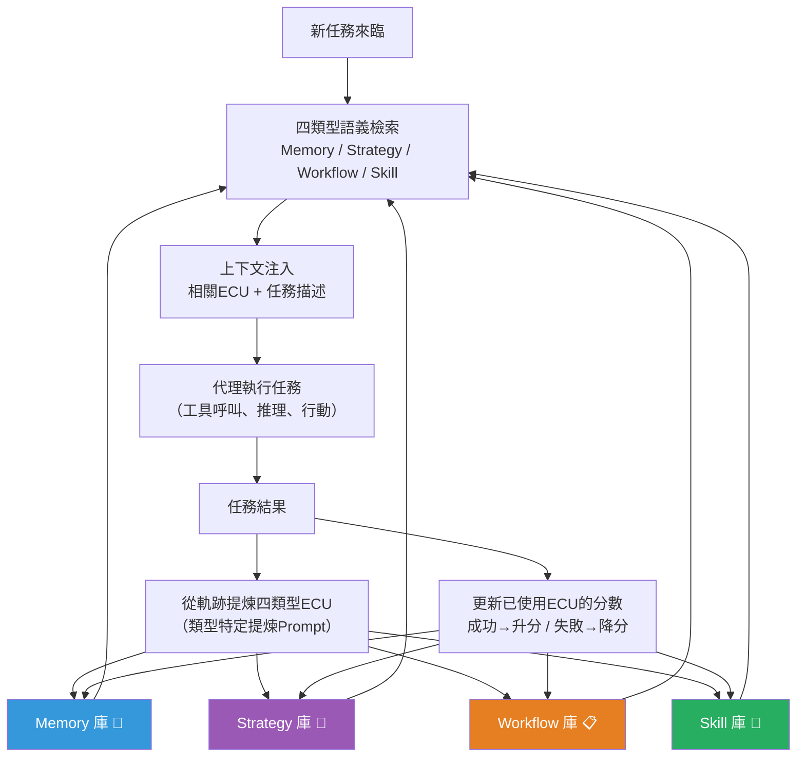

# UCE 統一上下文演化：讓 AI 代理建立四種類型的工作記憶庫

> [!abstract] 一句話理解
> 這是一個用來「讓 LLM 代理從每次任務中萃取四種類型可重用知識（記憶、策略、流程、技能）並在未來任務中自動取用」的框架，特別之處在於它用「知識分類學（taxonomy）+ 使用評分機制」解決了舊有記憶系統「不分類、不評分、越積越混亂」的根本問題——像是把代理的工作筆記從「一個雜亂的筆記本」升級為「四個有評分系統的專業知識庫」。

## 🎯 為什麼重要

**它解決了什麼問題？**

**問題一：LLM 代理的「永久失憶症」**

現有的 LLM 代理在每次新任務開始時，都從完全相同的固定初始狀態出發。無論代理在上一個任務中有多麼精彩的發現——一個特別有效的分解策略、一個工具的使用技巧、一個標準操作流程——任務結束後這些收穫就永遠消失，下一個任務的代理完全不知道它存在。

這像是一個資深工程師在每天上班時清空所有記憶，每天都以新人的狀態重新摸索。

**問題二：現有外部記憶方案的「知識倉庫混亂」問題**

部分代理框架嘗試透過外部記憶庫解決這個問題，但這些早期方案有兩個核心缺陷：

- **不分類**：把所有類型的知識（具體事實、策略原則、工作流程、工具技巧）都丟進同一個記憶庫，檢索時信噪比很低——搜尋「如何使用 SQL 查詢工具」可能撈回一堆不相關的事實記憶
- **不評分**：沒有機制區分「哪些記憶在實際任務中被驗證有效」和「哪些記憶只是被記錄但從未被驗證」，導致劣質知識積累污染整個記憶庫

UCE 的核心貢獻就是**同時解決**上述兩個問題：用四類型分類組織知識，用使用評分動態評估品質。

**問題三：梯度更新的高成本**

讓模型真正「學習」的傳統方式是重新訓練（fine-tuning），成本極高且週期很長。UCE 是完全無梯度（gradient-free）的方案——不改動模型任何參數，只透過外部記憶庫讓代理行為進化。

## 🧠 入門解說（用類比理解）

**把 UCE 比作一個四格筆記系統**

想像你是一位律師助理，每天要處理各種法律事務。你決定建立一個工作筆記系統，不是把所有東西亂寫在一個筆記本裡，而是分四個本子：

📝 **記憶本（Memory）**：
具體發生的事情和發現到的事實。
例：「J 法院的電子系統在下午 2 點到 3 點之間經常維護，這段時間無法提交文件」

📐 **策略本（Strategy）**：
解決各類問題的高層次方法論。
例：「面對複雜的跨境合約糾紛，先釐清準據法再討論具體條款，可以節省 60% 的無效爭論時間」

📋 **流程本（Workflow）**：
處理特定類型案件的標準操作程序。
例：「處理員工不當解僱投訴的標準流程：確認勞動契約 → 查詢相關法規 → 評估賠償標準 → 起草和解方案」

🔧 **技能本（Skill）**：
使用特定工具或完成特定技術動作的最佳實踐。
例：「使用 LexisNexis 搜尋先例時，先用案件事實關鍵詞而非法條編號，召回率高 3 倍」

每次你完成一個案件，你在相關本子上更新筆記。每條筆記有一個「可靠度評分」——如果這條筆記在 5 個後續案件中都有效，評分就高；如果試了 3 次都沒用，評分就低，排序下降。

這就是 UCE 的工作方式。

## 🔑 重點原理

1. **四類型 ECU 分類架構（Taxonomy of Evolvable Context Units）**：UCE 將代理知識強制分為四類，每類有不同的提煉條件和適用時機。Memory 是具體事實性發現，適用範圍較窄但精準；Strategy 是跨任務有效的方法論，抽象度高、遷移性強；Workflow 是針對特定任務類別的 SOP 序列；Skill 是工具使用技巧，精準對應特定操作場景。

2. **類型特定的提煉 Prompt（Type-Specific Extraction）**：不同類型的 ECU 有不同的「提煉指令」。提煉 Strategy 時，prompt 強調「這個原則是否在多個任務中都有效？」；提煉 Skill 時，prompt 聚焦「具體的工具呼叫模式和參數選擇」。這種差異化提煉確保每個 ECU 在其類別中是純粹的。

3. **使用評分機制（Usage-Based Scoring）**：每個 ECU 在首次生成時有基礎分，每次被實際使用後，依照任務結果（成功/失敗/部分成功）更新分數。高分 ECU 在後續任務的語義搜尋中優先返回，低分 ECU 自然淘汰，避免了人工標注的偏差和成本。

4. **語義索引與類型隔離（Semantic Index + Type Isolation）**：每種類型維護獨立的向量索引，確保搜尋 Memory 不會污染 Strategy 的結果。決策時，代理分別從四個索引中檢索最相關的 Top-K ECU，注入不同的上下文位置。

5. **無梯度學習（Gradient-Free Learning）**：整個 UCE 框架不修改底層 LLM 的任何參數。所有「學習」發生在外部記憶庫的更新上，這使得框架對任何 LLM 都適用，且可以即時更新——不需要等待一個訓練週期。

## 📊 視覺化說明

### UCE 的知識積累與取用循環

### UCE 四類型 ECU 比較

| ECU 類型 | 知識粒度 | 抽象度 | 跨任務遷移性 | 典型範例 |
|---|---|---|---|---|
| **Memory（記憶）** | 具體事實 | 低 | 低（情境特定）| 「系統 X 在週一上午維護」|
| **Strategy（策略）** | 方法論原則 | 高 | 高 | 「複雜任務先分解再各個擊破」|
| **Workflow（流程）** | 步驟序列 | 中 | 中（任務類別內）| 「客訴處理 SOP：確認→評估→方案→記錄」|
| **Skill（技能）** | 工具操作 | 低-中 | 中（同工具適用）| 「查詢 API Y 時加 filter=active 避免超時」|

## 🔍 與既有技術的差異

**vs. ERL（Experiential Reflective Learning，2603.24639）**

ERL 與 UCE 在同一時期提出，都強調從任務軌跡中提煉可重用的啟發式規則，核心思想高度相似。主要差異：
- ERL 只有一種類型的知識（統一稱為「啟發式規則」）；UCE 明確分為四類
- UCE 有顯式的使用評分機制；ERL 的規則品質管控較為隱性
- UCE 的分類架構使檢索更精準；ERL 的統一記憶庫在規模擴大後可能面臨更高的信噪比問題

**vs. MemGPT**

MemGPT 是一個記憶管理架構，讓 LLM 在上下文視窗超限時自動壓縮和調取對話歷史。兩者的根本差異在於：MemGPT 存儲的是「對話歷史」（What happened），UCE 存儲的是從歷史中**提煉的知識**（What was learned）。UCE 的記憶層次更高、更抽象，遷移性更強。

**vs. Toolformer**

Toolformer 讓 LLM 學會「何時應該呼叫工具」（工具觸發的元學習）。UCE 的 Skill 類型 ECU 解決的是「如何更有效地使用已知工具」（工具使用的最佳實踐），兩者可以疊加互補。

## 📚 關鍵詞對照表

| 中文 | 英文 | 簡短解釋 |
|---|---|---|
| 可演化上下文單元 | Evolvable Context Unit (ECU) | UCE 框架中被存儲和更新的知識單元 |
| 統一上下文演化 | Unified Context Evolution (UCE) | 本篇論文提出的代理學習框架名稱 |
| 無梯度學習 | Gradient-Free Learning | 不需更新模型參數的學習方式 |
| 使用評分 | Usage-Based Scoring | 依據知識單元在實際使用中的成效動態調整其優先級 |
| 語義嵌入 | Semantic Embedding | 將文字轉化為向量以支持語義搜尋 |
| 上下文注入 | Context Injection | 將外部知識（ECU）插入模型推理提示詞的技術 |
| 知識分類學 | Knowledge Taxonomy | 對知識按類型系統性分類的框架 |
| 跨任務遷移 | Cross-task Transfer | 在一類任務上學到的知識應用到不同類型任務的能力 |

## 🛠️ 可能的應用場景

1. **企業長期部署的 AI 工作代理**：法律研究代理、採購分析代理、客服代理等在長期運行中積累組織特有的 SOP（Workflow）和領域最佳實踐（Strategy），讓代理的服務品質隨時間自然提升。

2. **軟體開發代理（Coding Agent）**：如 Claude Code 類型的 AI 開發工具，在不同代碼庫和項目中積累組織的代碼風格偏好（Strategy）、常用框架的最佳用法（Skill），以及常見需求的實現模式（Workflow）。

3. **科學研究代理**：在多輪實驗規劃代理中，積累「哪些假設方向已被否定（Memory）」、「什麼研究方法論最有效（Strategy）」、「標準實驗設計流程（Workflow）」和「特定分析工具的技巧（Skill）」。

4. **多代理協作系統的共享知識庫**：在 Multi-Agent 系統中，多個子代理共享同一個 UCE 記憶庫，讓任何一個代理的學習成果能即時讓整個系統受益，實現集體知識積累。

5. **個性化 AI 助理**：個人助理從使用者互動中積累其工作偏好（Strategy：「這個使用者偏好先給結論再給論據」）和慣用流程（Workflow：「每週一早上的例行工作」），提供越來越精準的個性化服務。

## 📖 學習路徑建議

1. **先讀**：LLM Agent 基礎（ReAct 框架）——理解現代 LLM 代理如何整合推理和工具呼叫
2. **先讀**：RAG（檢索增強生成）基礎——UCE 的 ECU 檢索機制底層是語義搜尋，理解 RAG 有助於掌握 UCE 的運作原理
3. **再讀**：ERL 框架（arXiv 2603.24639）——UCE 的「兄弟框架」，理解兩者的異同有助於深化理解
4. **再讀**：本篇對應新聞筆記——[[2026-06-07-統一上下文演化框架UCE讓LLM代理持續積累四類型經驗]]
5. **進階**：MemGPT 論文——理解基於對話歷史的外部記憶方案，與 UCE 的知識提煉方案形成對比

## 🔗 延伸閱讀
- 原文連結：[arXiv 2606.02304](https://arxiv.org/abs/2606.02304)
- 對應新聞筆記：[[2026-06-07-統一上下文演化框架UCE讓LLM代理持續積累四類型經驗]]
- 相關框架：[ERL 學習筆記](https://arxiv.org/abs/2603.24639)
- 相關技術：[Agentic Context Engineering (arXiv 2510.04618)](https://arxiv.org/html/2510.04618v1)

---
*由 Claude 自動整理於 2026-06-07*
