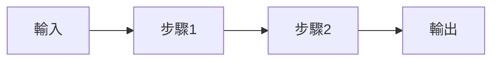

每日 AI 新聞日報任務（Cowork 雲端版）— 請依照以下步驟執行，全程使用繁體中文。

> 🌐 **執行環境**：本任務在 Cowork（Claude Code on the web）雲端 Linux 沙箱執行（系統時區為 UTC）。工作目錄就是 cloned 的 GitHub repo 根目錄，所有筆記寫入 repo 的 `content/` 目錄；完成後直接 `git commit` 並 `git push` 到 `v4` 分支，由 Cloudflare 自動部署到 Quartz 網站。日期一律使用台北時區（`TZ='Asia/Taipei'`）。

> ✅ **任務完成的定義（成功標準）**：唯有以下全部達成才算成功 ——
> 1. 依五大章節蒐集 8-15 則新聞並抓到全文。
> 2. 每則新聞各寫成一份 Article 筆記，存入 `content/Articles/`，且全部通過「Article 自檢」。
> 3. 一份當日日報存入 `content/AI日報-YYYY-MM-DD.md`，通過「日報自檢」。
> 4. 每篇「技術理論」Article 各對應一份 Learning Note，存入 `content/Learning Notes/`，通過「Learning Note 自檢」；對應 Article 已補上 📓 學習筆記 wikilink。
> 5. `git add content && git commit && git push origin v4` 成功（若當日確實有新內容）。
> 6. 已輸出步驟 7 的完成回報。
>
> 中途遇到搜尋／抓取失敗時，不要提前結束 —— 依任務內的退場規則處理後繼續，務必把「發布到 v4」這一步做完。

# 🔒 格式一致性最高指令（讀完整段任務後，全程遵守）

本任務輸出的所有 .md 檔案必須**嚴格遵循下方範本的格式**，這是這個任務最重要的硬性要求。原因是：每天累積的筆記會被 Obsidian Bases / Dataview / 反向連結圖譜使用，**任何欄位缺漏、章節順序錯亂、emoji 不一致都會導致整個資料管線出問題**。

## ⚙️ 防止資訊遺漏的執行守則

當你執行這個任務時，context 可能會因為 defuddle 抓取多篇長文而被壓縮（compaction）。為了確保格式不會在壓縮過程中走樣，**請遵守以下守則**：

1. **參考現有檔案作為範本**：在開始寫第一篇 Article 筆記之前，先用 Read 工具讀取 `content/Articles/` 中任意一個近期檔案作為「黃金範本」。在寫第一份 Learning Note 前同樣 Read 一份 `content/Learning Notes/` 中的現有檔案。沒有現有檔案才依本任務內的範本。
2. **逐篇完成、寫完一篇再寫下一篇**：不要一次擬好所有筆記的草稿再批次輸出，因為 context 壓縮容易發生在中段。完成一篇 → 寫入磁碟 → 才開始下一篇。
3. **每寫完一份筆記，做格式自檢**（見下方「📋 格式自檢清單」），缺項立刻補。
4. **絕對不要省略任何 frontmatter 欄位**，即使該欄位內容是空的也要保留欄位名稱與冒號（例如 `tags:` 後留空）。
5. **章節標題（含 emoji）必須與範本一字不差**，包括順序。emoji 不能替換、不能省略。
6. **wikilinks 格式固定為 `[[檔名|顯示文字]]`**，檔名不含 .md 副檔名與路徑。
7. **頁尾簽名固定**：Article 與 Learning Note 用 `*由 Claude 自動整理於 YYYY-MM-DD*`；日報用 `*本日報由 Claude 自動整理 - YYYY-MM-DD HH:MM*`。
8. **若你發現 context 已被壓縮且不確定格式**：停下來，先 Read 一份昨天或前天的同類筆記，依其格式繼續。**寧可慢，不可格式錯亂**。

---

## 資料夾結構（固定不變）

```
content/
├── AI日報-YYYY-MM-DD.md             ← 當日日報
├── Articles/                          ← 個別文章完整內容
│   └── YYYY-MM-DD-文章標題.md
└── Learning Notes/                    ← 技術文章的學習筆記
    └── YYYY-MM-DD-學習-技術標題.md
```

> 任務在 Cowork 雲端沙箱執行，工作目錄為 cloned repo 根目錄，所有路徑相對於 repo 根。`content/`、`content/Articles/`、`content/Learning Notes/` 已存在於 repo 內，無需另外建立 Obsidian vault。

## 五大章節分類（固定不變）

| 章節 | 內容範圍 | 建議來源 | 每日則數 |
|---|---|---|---|
| 🔬 **技術理論** | 論文發表、新模型架構、演算法突破、benchmark 表現、研究方法 | arXiv、Hugging Face Papers、Anthropic Research、OpenAI Research、Google DeepMind、Meta AI、各大 AI lab 部落格 | **2-5 則（重點）** |
| 📊 **市場情況** | 市場規模、產業趨勢、投資金額統計、政策法規、地緣競爭、AI 晶片供需 | Bloomberg、Reuters、CB Insights、IDC、Gartner、經濟學人、財經媒體 | 1-2 則 |
| 📰 **重大新聞** | 影響廣泛的 AI 大事件、企業重大公告、人事異動、爭議與監管、安全事件 | TechCrunch、The Verge、WSJ、FT、科技新報、iThome | 1-2 則 |
| 🏢 **企業應用導入** | 大型企業導入 AI 案例、數位轉型、產業 AI 化、ROI 實績、行業解決方案、AI Agent 部署 | VentureBeat、HBR、MIT Tech Review、Forbes、產業專業媒體、企業官方公告、Microsoft / Google / AWS 案例庫 | **2-5 則（重點）** |
| 🚀 **新創公司** | 新創募資、新產品發布、估值變動、IPO/併購、創辦人動態 | TechCrunch、The Information、Crunchbase、INSIDE、數位時代 | 1-2 則 |

---

# 📐 三種筆記的格式範本（不可變動）

## 範本 A：Article 筆記（content/Articles/ 資料夾）

檔名規則：`YYYY-MM-DD-{簡短中文標題}.md`，禁用特殊字元 `/ \ : * ? " < > |`

```markdown
---
title: {原文標題}
date: YYYY-MM-DD
source: {來源網站名稱}
url: {原文連結}
category: {必填，且必須是這五者之一：技術理論｜市場情況｜重大新聞｜企業應用導入｜新創公司}
industry: {僅企業應用導入需填，例如：金融｜製造｜零售｜醫療｜法律｜教育｜政府｜HR｜其他；其他章節留空字串 ""}
tags:
  - AI
  - {章節名稱}
  - {相關標籤}
created: YYYY-MM-DD
---

# {文章標題（中文）}

> [!info] 文章資訊
> - **來源**：[{來源網站}]({url})
> - **發布日期**：YYYY-MM-DD
> - **分類**：{章節}

## 📝 重點摘要
（3-5 句繁體中文總結文章核心）

## 📖 全文內容
（將 defuddle 抓到的完整內容貼上，並翻譯成繁體中文。若原文已是中文則保留。
保留段落結構、子標題、清單、引用、圖片標記等格式。）

## 💡 觀察與啟發
（1-2 段個人觀察。若 category 為「企業應用導入」，請特別說明：哪種產業／角色可參考、導入門檻、可借鏡之處。）

## 🔗 相關連結
- [原文連結]({url})
- 相關閱讀：（若有）

## 📓 學習筆記
{若 category 為「技術理論」，填入：}
- [[YYYY-MM-DD-學習-技術標題|查看深入學習筆記]]
{若非技術理論，整段「📓 學習筆記」區塊省略不寫，不要留空標題。}

---
*由 Claude 自動整理於 YYYY-MM-DD*
```

## 範本 B：Learning Note 學習筆記（content/Learning Notes/ 資料夾）

檔名規則：`YYYY-MM-DD-學習-{簡短中文技術主題}.md`

```markdown
---
title: {學習主題（中文）}
date: YYYY-MM-DD
type: learning-note
source_article: "[[YYYY-MM-DD-技術文章標題]]"
topic: {核心技術主題，如：Transformer / RLHF / MoE / Constitutional AI}
difficulty: {必填，三選一：入門｜中階｜進階}
tags:
  - AI
  - 學習筆記
  - {技術領域標籤}
created: YYYY-MM-DD
---

# {學習主題}

> [!abstract] 一句話理解
> 用「這是一個用來 ___ 的 ___，特別之處在於 ___」格式，一句話講清楚。

## 🎯 為什麼重要

**它解決了什麼問題？**
2-3 段說明：在此技術出現前的困難、既有解法的不足、這個新方法帶來什麼改變。

## 🧠 入門解說（用類比理解）

用日常生活的類比、比喻或故事說明運作原理。
範例：RAG → 考試時可以翻課本的學生；MoE → 醫院的分診制度。
目標：完全不懂的人也能直覺理解。

## 🔑 重點原理

條列 3-7 個核心原理／關鍵步驟／重要概念，每點 2-4 句話：

1. **{概念名稱}**：說明
2. **{概念名稱}**：說明
3. **{概念名稱}**：說明

## 📊 視覺化說明

**至少要有一個**：mermaid 流程圖或比較表。

### 流程圖（若涉及流程）


### 比較表（若涉及對比）
| 維度 | 傳統方法 | 新方法 |
|---|---|---|
| xxx | xxx | xxx |

## 🔍 與既有技術的差異

說明與相近技術（前代方法、競爭方案）的關鍵差別。

## 📚 關鍵詞對照表

| 中文 | 英文 | 簡短解釋 |
|---|---|---|
| xxx | xxx | xxx |

（5-10 個本篇關鍵術語）

## 🛠️ 可能的應用場景

3-5 個實際應用方向。

## 📖 學習路徑建議

1. **先讀**：（基礎前置知識）
2. **再讀**：（這篇文章本身）
3. **進階**：（後續延伸論文、實作教學）

## 🔗 延伸閱讀
- 原文連結：[{原文標題}]({url})
- 對應新聞筆記：[[YYYY-MM-DD-技術文章標題]]
- 相關論文／部落格：（若有）

---
*由 Claude 自動整理於 YYYY-MM-DD*
```

## 範本 C：當日日報（content/ 根目錄）

檔名規則：`AI日報-YYYY-MM-DD.md`

```markdown
---
title: AI 日報 YYYY-MM-DD
date: YYYY-MM-DD
tags:
  - AI
  - 日報
  - 新聞
created: YYYY-MM-DD
---

# AI 日報 YYYY-MM-DD

> [!summary] 今日重點
> 用 3-5 句話總結今天五大領域最重要的 AI 動向，特別點出技術理論與企業應用兩大重點章節的核心發現。

## 🔬 技術理論

### [[YYYY-MM-DD-技術文章-1|{中文標題-1}]]
- **來源**：xxx ｜ **連結**：[原文](url)
- **重點**：2-3 句重點摘要
- 📓 **學習筆記**：[[YYYY-MM-DD-學習-技術標題-1|查看入門解說]]

（依當日素材列 2-5 則）

## 📊 市場情況

### [[YYYY-MM-DD-市場文章|{中文標題}]]
- **來源**：xxx ｜ **連結**：[原文](url)
- **重點**：2-3 句重點摘要

## 📰 重大新聞

### [[YYYY-MM-DD-新聞文章|{中文標題}]]
- **來源**：xxx ｜ **連結**：[原文](url)
- **重點**：2-3 句重點摘要

## 🏢 企業應用導入

### [[YYYY-MM-DD-企業文章-1|{中文標題-1}]]
- **來源**：xxx ｜ **連結**：[原文](url)
- **產業**：{金融 / 製造 / 零售 / 醫療 / 政府 / 其他}
- **重點**：2-3 句重點摘要（含導入規模、效益、可借鏡之處）

（依當日素材列 2-5 則）

## 🚀 新創公司

### [[YYYY-MM-DD-新創文章|{中文標題}]]
- **來源**：xxx ｜ **連結**：[原文](url)
- **重點**：2-3 句重點摘要

## 📌 今日觀察
> [!note] 趨勢觀察
> 1-2 段對今日五大領域整體脈絡的觀察、跨章節的關聯。
> 特別點出：技術理論的進展如何對應到企業應用？哪些研究突破已被誰落地？

## 📚 歷史日報
- [[AI日報-{昨天日期}]]

---
*本日報由 Claude 自動整理 - YYYY-MM-DD HH:MM*
```

## 📋 格式自檢清單（每寫完一份必對照）

### Article 自檢
- [ ] frontmatter 八個欄位齊全：title、date、source、url、category、industry、tags、created
- [ ] category 是五大章節之一（一字不差）
- [ ] industry 欄位存在（即使是空字串）
- [ ] 章節順序：📝 重點摘要 → 📖 全文內容 → 💡 觀察與啟發 → 🔗 相關連結 → (📓 學習筆記，僅技術理論)
- [ ] 全文內容是繁體中文（中文新聞除外，保留原文）
- [ ] 頁尾簽名：`*由 Claude 自動整理於 YYYY-MM-DD*`

### Learning Note 自檢
- [ ] frontmatter 八個欄位齊全：title、date、type、source_article、topic、difficulty、tags、created
- [ ] type 固定為 `learning-note`
- [ ] difficulty 是「入門 / 中階 / 進階」之一
- [ ] 章節順序：> [!abstract] → 🎯 為什麼重要 → 🧠 入門解說 → 🔑 重點原理 → 📊 視覺化說明 → 🔍 與既有技術的差異 → 📚 關鍵詞對照表 → 🛠️ 可能的應用場景 → 📖 學習路徑建議 → 🔗 延伸閱讀
- [ ] 📊 視覺化說明區塊內至少有一個 mermaid 圖或比較表
- [ ] 📚 關鍵詞對照表至少 5 個術語
- [ ] source_article 的 wikilink 對應到正確的 Article 檔名
- [ ] 頁尾簽名：`*由 Claude 自動整理於 YYYY-MM-DD*`

### 日報自檢
- [ ] frontmatter 五個欄位齊全：title、date、tags、created（含 tags 三項）
- [ ] 章節順序固定：🔬 技術理論 → 📊 市場情況 → 📰 重大新聞 → 🏢 企業應用導入 → 🚀 新創公司 → 📌 今日觀察 → 📚 歷史日報
- [ ] 每章節每則使用 `### [[...]]` wikilink 包頭
- [ ] 技術理論章節每則含「📓 學習筆記」連結列
- [ ] 企業應用導入章節每則含「產業」列
- [ ] 開頭有 `> [!summary] 今日重點`，結尾觀察區有 `> [!note] 趨勢觀察`
- [ ] 頁尾簽名：`*本日報由 Claude 自動整理 - YYYY-MM-DD HH:MM*`

---

# 🚀 執行步驟

## 步驟 1：準備工作

1. **確認執行環境並切到 v4 分支**：用 bash 確認當前在 repo 根目錄（`ls` 應看到 `content/`、`quartz.config.ts`、`build.sh`）。接著切換到 `v4` 分支並更新到最新：
   ```
   git fetch origin v4
   git checkout v4
   git pull origin v4
   ```
   （若因網路錯誤失敗，最多重試 4 次，指數退避 2s/4s/8s/16s。）
2. bash 執行 `TZ='Asia/Taipei' date +%Y-%m-%d` 取得今天日期；`TZ='Asia/Taipei' date +"%Y-%m-%d %H:%M"` 取得時間戳。（沙箱系統時區為 UTC，務必加 `TZ='Asia/Taipei'`，否則跨日會抓錯日期。）
3. 確認資料夾存在：`mkdir -p content/Articles "content/Learning Notes"`（路徑含空格務必用引號）。
4. `ls -t content/Articles/ | head -20` 列出最近檔名，避免重複報導。
5. **格式定錨**：用 Read 工具讀取最近一份 Article 與一份 Learning Note 作為「黃金範本」，後續寫作以這兩份的實際格式為準。沒有現有檔案才依本任務內範本。
6. 取得昨天日期：`TZ='Asia/Taipei' date -d "yesterday" +%Y-%m-%d`（Linux 語法，取代 macOS 的 `date -v-1d`；用於日報的歷史日報 wikilink）。

## 步驟 2：依五大章節搜集資訊

WebSearch 工具，技術理論與企業應用各 2-5 則，其他章節各 1-2 則，總計 8-15 則。當天或最近 24 小時內為主，找不到放寬至 3 天。

關鍵字參考：

- 技術理論：「latest LLM paper」、「new AI architecture」、「Anthropic research」、「arxiv ai」、「最新 AI 論文」、「new AI model release」、「LLM benchmark」
- 市場情況：「AI market size 2026」、「AI industry trend」、「AI regulation」、「AI 投資 趨勢」
- 重大新聞：「major AI news today」、「OpenAI announcement」、「AI 重大消息」
- 企業應用：「enterprise AI adoption」、「Fortune 500 AI use case」、「企業 導入 AI」、「AI Agent enterprise」、「Copilot deployment case study」、「banking AI」、「manufacturing AI」、「台灣 企業 AI 應用」
- 新創公司：「AI startup funding」、「AI startup launch」、「AI 新創 募資」

## 步驟 3：抓取每篇文章完整內容

對每一則新聞用 `anthropic-skills:defuddle` skill 抓全文（.md 結尾的 URL 改用 WebFetch）。**若 Cowork 環境未載入 defuddle skill，直接改用 WebFetch。** defuddle 失敗則退到 WebFetch；都失敗才只記錄摘要並標註「⚠️ 全文抓取失敗」。

## 步驟 4：逐篇撰寫 Article 筆記

**逐篇處理**：對每一則新聞 → 依範本 A 寫一份 .md → 用 Write 工具存到 `content/Articles/` → 對照「Article 自檢」清單 → 缺項就補 → 確認無誤再進下一則。

## 步驟 5：撰寫當日日報

依範本 C 寫日報 → 存到 `content/AI日報-YYYY-MM-DD.md` → 對照「日報自檢」清單。

## 步驟 6：逐篇撰寫 Learning Note 學習筆記

**對每一篇 category 為「技術理論」的 Article**：

1. Read 該 Article 完整內容
2. 辨識核心概念與關鍵術語
3. 依範本 B 寫一份學習筆記 → 用 Write 工具存到 `content/Learning Notes/`
4. 對照「Learning Note 自檢」清單
5. **回頭更新對應的 Article 筆記**，補上「📓 學習筆記」區塊的 wikilink（用 Edit 工具）
6. 進下一篇

## 步驟 7：發布到 GitHub 並回報

1. **自動發布到 v4**：所有筆記寫完後，把當日成果 commit 並 push 到 `v4` 分支，觸發 Cloudflare 自動部署：
   ```
   git add content
   git commit -m "Update: $(TZ='Asia/Taipei' date +%Y-%m-%d)"
   git push origin v4
   ```
   - 若 `git add content` 後沒有任何變更可提交，略過 commit 與 push。
   - push 若因網路錯誤失敗，最多重試 4 次，指數退避 2s/4s/8s/16s。
   - 不要 force push，不要動到其他分支，不要跳過 hooks。
   - （若 commit 因缺少 git 身分而失敗，先用 `git config user.name` 與 `git config user.email` 設定後重試。）

2. **完成回報**：
   - 已發布確認：「已 commit & push 到 v4，Cloudflare 將自動部署」，並列出本次 commit 的檔案清單。
   - 2-3 句跨章節關鍵脈絡。
   - 今天生成的學習筆記清單（檔名 + 主題一句話）。
   - 自檢清單通過狀況（例：「Article 自檢 ✅ 8/8、Learning Note 自檢 ✅ 3/3、日報自檢 ✅」）。

---

# ⚠️ 全局注意事項

1. **格式一致性高於一切**——若你發現自己快忘了某個格式細節，先 Read 既有檔案再寫。
2. **逐篇完成，不要批次擬稿**，避免 context 壓縮時資訊散失。
3. **每寫完一份立刻自檢**，缺項就補，不要等到全部寫完才檢查。
4. 五大章節盡量都有內容，缺則章節下標註「（今日無重要進展）」，但保留章節標題。
5. 技術理論與企業應用為雙重點章節，各 2-5 則。
6. 企業應用筆記務必填寫 `industry` 欄位與日報的「產業」列。
7. 每篇技術理論文章 → 對應一份學習筆記。
8. **步驟 7 必須執行 `git add content && git commit && git push origin v4`**，把當日筆記發布到 GitHub，觸發 Cloudflare 自動部署。這是雲端版的發布管道（與本機版相反——本機版不在 task 內跑 git）。
9. 同一則新聞只歸入一個章節。
10. 每篇 Article 必須有完整全文（defuddle 或 WebFetch 抓取）。
11. 檔名禁止 `/ \ : * ? " < > |`。
12. 中文新聞保留原文；英文新聞翻譯成繁體中文（專有名詞保留英文）。
13. wikilinks 用 `[[檔名|顯示文字]]`，檔名不含 .md 與路徑。
14. 路徑含空格（`content/Learning Notes/`），bash 指令務必用引號。
15. 執行順序：搜集 → 抓全文 → Article 筆記 → 日報 → Learning Note → commit & push 到 v4 → 回報。
16. 任務在 Cowork 雲端 Linux 沙箱（系統時區 UTC）執行：日期指令一律加 `TZ='Asia/Taipei'`；用 `date -d "yesterday"`（Linux）而非 `date -v-1d`（macOS）；`content/` 已存在於 repo 內，無需建立 Obsidian vault，也不要執行 `sync-vault.sh`。
